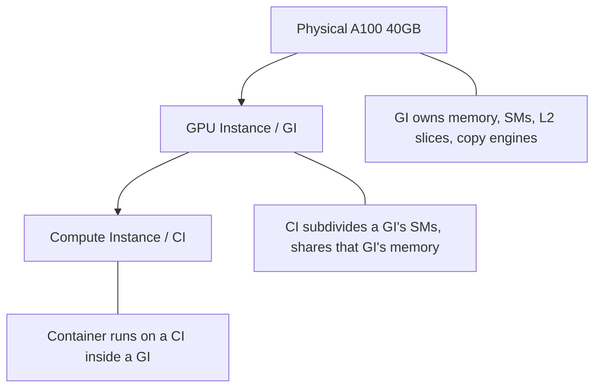

# Lab 5.19 — Multi-Instance GPU (MIG) Partitioning

**Domain:** GPU Partitioning / Hardware Isolation / Dynamic Resource Allocation

> **Upstream references:** [GPU Operator MIG guide](https://docs.nvidia.com/datacenter/cloud-native/gpu-operator/latest/gpu-operator-mig.html) · [MIG User Guide](https://docs.nvidia.com/datacenter/tesla/mig-user-guide/) · [`mig-parted`](https://github.com/NVIDIA/mig-parted) · [DRA driver for NVIDIA GPUs](https://docs.nvidia.com/datacenter/cloud-native/gpu-operator/latest/dra-intro-install.html)

---

## Lab Navigation

| Track | Tier | Duration |
|-------|------|----------|
| Advanced GPU Partitioning | Optional — **requires `p4d.24xlarge`** | 3.2 hours |

### Week 5 Learning Paths

```
5.16 Dist Train ➔ 5.17 OTel ➔ 5.18 topograph ➔ [5.19] MIG (YOU ARE HERE)
```

| Previous | Current | Next |
|----------|---------|------|
| [Lab 5.18 — topograph / NVLink Topology](lab-5.18-topograph-nvlink-topology.md) | **Lab 5.19 — MIG Partitioning** | [Week 6 — Multi-Tenancy](../../week-6-multitenancy/) |

---

**Duration:** 3.2 hours (required tasks) + 30 min optional
**Type:** Hands-on Technical (Advanced)
**Environment:** k0rdent-managed GPU cluster with a **`p4d.24xlarge`** worker (8x NVIDIA A100-SXM4-40GB)

> **⚠️ Validation status: NOT YET LIVE-VALIDATED.**
> Output blocks in this lab marked `# UNVERIFIED` are derived from NVIDIA
> documentation and have **not** been captured from a live `p4d.24xlarge` run.
> Treat the shapes as indicative, not exact. They will be replaced with real
> captures once the validation run completes. Every unmarked command is a
> standard `kubectl`/`helm` invocation.

> **💸 COST WARNING — read before you provision.**
> `p4d.24xlarge` is **~$32.77/hour on-demand**. The required tasks take ~3.2 hours,
> so a single sitting costs **~$105**, plus ~$0.40/hr for the control plane and NAT.
> Leaving this cluster running overnight costs **~$790**.
> Provision it when you are ready to work through the lab in one pass, and run the
> [Cleanup](#cleanup) steps the moment you finish. Set a calendar reminder.

> **🔓 Licensing: nothing to buy.** Unlike [Lab 5.4](lab-5.4-runai-gpu-orchestration.md)
> (Run:ai commercial license) and [Lab 5.11](lab-5.11-nvidia-fips.md) (NVIDIA AI
> Enterprise entitlement), every component here is free: MIG is a GPU/driver
> feature, and the GPU Operator, `mig-parted`, DCGM, and the DRA driver are all
> Apache-2.0. No NGC API key is required. The only cost is AWS compute.

## Table of Contents

- [Objective](#objective)
- [Prerequisites](#prerequisites)
- [k0rdent Context](#k0rdent-context)
- [Part 1: What MIG Actually Partitions](#part-1-what-mig-actually-partitions)
- [Tasks](#tasks)
  - [Task 1: Provision the p4d Cluster and Enable the MIG Stack](#task-1-provision-the-p4d-cluster-and-enable-the-mig-stack-20-min)
  - [Task 2: Enable MIG Mode on the GPUs](#task-2-enable-mig-mode-on-the-gpus-30-min)
  - [Task 3: Single vs Mixed Strategy and Resource Naming](#task-3-single-vs-mixed-strategy-and-resource-naming-30-min)
  - [Task 4: Schedule Workloads onto MIG Slices](#task-4-schedule-workloads-onto-mig-slices-25-min)
  - [Task 5: Prove Hardware Memory Isolation](#task-5-prove-hardware-memory-isolation-25-min)
  - [Task 6: Allocate MIG Slices Through DRA](#task-6-allocate-mig-slices-through-dra-40-min)
  - [Task 7 (Optional): Per-Slice Metering with DCGM](#task-7-optional-per-slice-metering-with-dcgm-30-min)
  - [Task 8: Reconfigure, Revert, and Tear Down](#task-8-reconfigure-revert-and-tear-down-20-min)
- [Cleanup](#cleanup)
- [Troubleshooting](#troubleshooting)
- [Verification Checklist](#verification-checklist)
- [Key Takeaways](#key-takeaways)
- [References](#references)
- [Next Steps](#next-steps)

---

## Objective

Partition physical A100 GPUs into hardware-isolated instances, schedule workloads
onto individual slices, prove that the isolation is real by making one slice fail
without affecting its neighbour, allocate a slice declaratively through Dynamic
Resource Allocation, then reconfigure and revert the partitioning.

By the end you will be able to:

- [ ] Explain what a GPU Instance and a Compute Instance each isolate
- [ ] Enable MIG on a k0rdent-managed cluster via the GPU Operator's MIG manager
- [ ] Predict which MIG profiles are valid on a given GPU from slice arithmetic
- [ ] Choose between `single` and `mixed` device-plugin strategies and explain how each renames resources
- [ ] Demonstrate hardware memory isolation and contrast it with time-slicing and KAI fractions
- [ ] Allocate a MIG slice with a `ResourceClaimTemplate` against the `mig.nvidia.com` DeviceClass
- [ ] Reconfigure a MIG layout and explain why it is a node-level maintenance operation

---

## Prerequisites

- **[Lab 5.1](lab-5.1-gpu-cluster-setup.md)** — GPU Operator on k0s, including the
  containerd path values and the time-slicing task. MIG is the contrast case to
  Lab 5.1 Task 6; do that first or this lab loses its point.
- **[Lab 5.3](lab-5.3-kai-scheduler.md)** — KAI fractional GPUs. Task 5 here is a
  direct answer to Lab 5.3's warning that KAI does *not* enforce memory limits.
- Working k0rdent management cluster (Lab 1.1) and experience with
  `ClusterDeployment` (Lab 1.5).
- **[Lab 1.3](../../week-1-foundations/labs/lab-1.3-configure-aws-provider.md) —
  AWS provider credential.** `lab-provision.sh` does **not** create this for you.
  Without it the `ClusterDeployment` in Task 1 stalls at
  `InfrastructureReady: Condition not yet reported` with no obvious cause.
  Verify before you start — this check costs nothing, and finding out later costs
  p4d minutes:

  ```bash
  kubectl get credential aws-cluster-identity-cred -n kcm-system
  # NAME                        READY
  # aws-cluster-identity-cred   true
  ```

  If it is missing or `READY` is not `true`, complete Lab 1.3 Steps 1-3 first
  (secret → `AWSClusterStaticIdentity` → resource-template ConfigMap →
  `Credential`).

> **⚠️ If you authenticate with AWS SSO, read this before provisioning.** SSO
> session tokens expire, typically in 1-12 hours, and this lab runs ~3.2 hours on
> an instance costing $32.77/hour. The token is stored in
> `aws-cluster-identity-secret` and is what CAPA uses to **delete** your cluster,
> not just create it. If it expires mid-lab, CAPA logs `AuthFailure` and teardown
> fails — leaving a p4d running. Refresh with
> `./scripts/lab-refresh-creds.sh <your-name>` (which also restarts CAPA), and
> refresh again before you run [Cleanup](#cleanup) if your session is old.
- **AWS on-demand P-instance vCPU quota ≥ 96** in your region. `p4d.24xlarge` is
  96 vCPUs. Check before you start:

  ```bash
  aws service-quotas get-service-quota \
    --service-code ec2 --quota-code L-417A185B \
    --region us-east-1 --query 'Quota.Value' --output text
  ```

  If this returns less than 96, request an increase before continuing — approval
  is not instant.

- `p4d.24xlarge` capacity in your region. Confirm the AZs that offer it:

  ```bash
  aws ec2 describe-instance-type-offerings --location-type availability-zone \
    --filters "Name=instance-type,Values=p4d.24xlarge" \
    --region us-east-1 --query 'InstanceTypeOfferings[].Location' --output text
  ```

### Version pins

| Component | Pin | Notes |
|-----------|-----|-------|
| GPU Operator | **`v25.3.0`** | Same validated pin as the rest of Week 5. Do **not** bump to ≥25.10: the 25.10 toolkit ignores the k0s `CONTAINERD_CONFIG` path and its containerd config drops the `runc` runtime, taking the node `NotReady`. See Lab 5.1. |
| k0s | `v1.35.4+k0s.0` | Kubernetes 1.35 — DRA is GA here (`resource.k8s.io/v1`) |
| `nvidia-dra-driver-gpu` | Pin the chart version you validate | Required ≥ Kubernetes v1.34.2 |
| Worker AMI | `ami-00de3875b03809ec5` | Ubuntu 22.04 (us-east-1). Amazon Linux 2 is not supported by the GPU Operator. |

---

## k0rdent Context

MIG configuration is a **node-level** property, which makes it a natural fit for
k0rdent's template model rather than something tenants set per workload.

The partitioning layout is selected by a **node label**
(`nvidia.com/mig.config`). That means in production you express MIG geometry as
node pools: one `ClusterDeployment` worker group labelled for dense inference
slices, another left whole for training. Tenants then request the resource name
their slice size produces — they never choose a partitioning.

This lab configures MIG directly on the workload cluster so you can watch the
mechanism. Once you understand it, [Lab 5.12](lab-5.12-cluster-templates.md) shows
how to ship the same settings through a `ServiceTemplate`, remembering that GPU
Operator values must be nested under a top-level `gpu-operator:` key when
delivered that way.

---

## Part 1: What MIG Actually Partitions

Theory reference: [5.1 GPU Scheduling §5.4](../theory/5.1-gpu-scheduling.md#54-multi-instance-gpu-mig).
The essentials you need at the keyboard:

### The two-level model



Hardware memory isolation and fault isolation are properties of the **GI**
boundary. A CI split shares its parent GI's memory.

### Slice arithmetic

An A100 exposes **7 compute slices** and **8 memory slices**. On the 40GB part
each memory slice is **5 GB**. A profile `<N>g.<M>gb` consumes `N` compute slices
and enough memory slices to reach `M` GB.

| Profile | Compute | Memory slices | Max per GPU | Capped by |
|---------|---------|---------------|-------------|-----------|
| `1g.5gb` | 1 | 1 | **7** | compute |
| `1g.10gb` | 1 | 2 | **4** | memory |
| `2g.10gb` | 2 | 2 | **3** | compute |
| `3g.20gb` | 3 | 4 | **2** | both |
| `4g.20gb` | 4 | 4 | **1** | compute |
| `7g.40gb` | 7 | 8 | **1** | whole GPU |

> **The trap that catches everyone.** Profile *names* are not portable across
> memory sizes. `1g.10gb` on an **80GB** GPU costs 1 memory slice (max 7). On this
> **40GB** A100 it costs 2 (max 4). A layout copied from H100 documentation
> requesting seven `1g.10gb` instances is **impossible here**, and `mig-parted`
> rejects the geometry rather than silently giving you fewer.

### Where MIG sits among the sharing options

| | MIG | Time-slicing (Lab 5.1) | KAI fractions (Lab 5.3) | Run:ai fractions (Lab 5.4) |
|---|---|---|---|---|
| Memory isolation | **Hardware** | None | None (self-regulate) | Virtual address spaces |
| Compute isolation | **Hardware** | Time-division | Time-division | Time-division |
| Fault isolation | **Yes** | No | No | No |
| Overhead | Near-zero | 5-15% | 5-15% | 5-15% |
| Reconfiguration | GPU reset, node-level | Dynamic | Dynamic | Dynamic |
| Works on A10G | **No** | Yes | Yes | Yes |
| License | **None** | None | None | **NVIDIA Commercial** |

MIG is the only row with real isolation, and it pays for it with rigidity: you
cannot repartition without disrupting the node.

> **MIG and other fractioning cannot coexist on a node.** Lab 5.4 states this for
> Run:ai fractions. The same holds for time-slicing: do not apply a
> `time-slicing-config` to a node you have put into MIG mode.

---

## Tasks

### Task 1: Provision the p4d Cluster and Enable the MIG Stack (20 min)

#### 1.1 Create the GPU ClusterDeployment

From the management cluster (`./scripts/lab-connect.sh <your-engineer-id>`):

```yaml
# Save as mig-cluster.yaml
apiVersion: k0rdent.mirantis.com/v1beta1
kind: ClusterDeployment
metadata:
  name: mig-cluster
  namespace: kcm-system
spec:
  template: aws-standalone-cp-1-0-26
  credential: aws-cluster-identity-cred
  config:
    clusterLabels: {}
    region: us-east-1
    controlPlaneNumber: 1
    workersNumber: 1
    controlPlane:
      instanceType: t3.medium
      amiID: ami-00de3875b03809ec5      # Ubuntu 22.04
      rootVolumeSize: 50
    worker:
      instanceType: p4d.24xlarge         # 8x A100-SXM4-40GB
      amiID: ami-00de3875b03809ec5       # Ubuntu 22.04
      rootVolumeSize: 200
```

```bash
kubectl apply -f mig-cluster.yaml
kubectl get clusterdeployment mig-cluster -n kcm-system -w
```

**The $32.77/hour meter starts when the worker instance launches**, not when the
cluster becomes Ready. Provisioning takes ~15 minutes.

#### 1.1a Expect a capacity failure — and know how to steer around it

`p4d.24xlarge` is scarce, and capacity is **per Availability Zone**. The
`aws-standalone-cp-1-0-26` template exposes only `region` — it has **no AZ or
subnet field** — so CAPA picks an AZ for you, and if that AZ is dry your worker
never launches. It retries silently and indefinitely: the `ClusterDeployment` sits
at `WorkersAvailable`, the control plane comes up fine, and nothing tells you the
GPU node is the problem.

This is the single most likely way this lab stalls. Check for it before waiting:

```bash
kubectl get machines -n kcm-system
# A worker stuck in Provisioning with no INSTANCEID for >5 min is the symptom:
kubectl get awsmachines -n kcm-system

kubectl describe awsmachine -n kcm-system -l cluster.x-k8s.io/deployment-name=mig-cluster-md \
  | grep -A3 InsufficientInstanceCapacity
```

A real failure looks like this — note that AWS names the AZs that *do* have
capacity:

```
api error InsufficientInstanceCapacity: We currently do not have sufficient
p4d.24xlarge capacity in the Availability Zone you requested (us-east-1a). Our
system will be working on provisioning additional capacity. You can currently get
p4d.24xlarge capacity by not specifying an Availability Zone in your request or
choosing us-east-1b, us-east-1c, us-east-1d.
```

**Fix — pin the MachineDeployment to a `failureDomain`.** The cluster's VPC already
has subnets in three AZs; CAPI just needs to be told which to use:

```bash
# What AZs are available to this cluster?
kubectl get cluster mig-cluster -n kcm-system -o jsonpath='{.status.failureDomains}' | jq
# [{"controlPlane":true,"name":"us-east-1a"},{"name":"us-east-1b"},{"name":"us-east-1c"}]

# Steer the worker to an AZ AWS says has capacity
kubectl patch machinedeployment mig-cluster-md -n kcm-system --type=merge \
  -p '{"spec":{"template":{"spec":{"failureDomain":"us-east-1b"}}}}'
```

CAPI replaces the stuck machine with a new one in the chosen AZ. If that AZ is also
dry, patch to the next one — the error message always lists current options.

> **Why this is not in the ClusterDeployment manifest:** the template has no field
> for it. Patching the generated `MachineDeployment` is the supported CAPI-level
> escape hatch. It survives reconciliation because k0rdent does not manage
> `failureDomain`.

> **Cost note:** a stuck worker costs you nothing in GPU charges — no instance
> exists. You are only paying for the `t3.medium` control plane and NAT while you
> sort it out. Do not tear the cluster down and retry from scratch; patch the
> `failureDomain` instead.

#### 1.2 Connect to the workload cluster

```bash
kubectl get secret mig-cluster-kubeconfig -n kcm-system \
  -o jsonpath='{.data.value}' | base64 -d > ~/.kube/mig-cluster.conf
export KUBECONFIG=~/.kube/mig-cluster.conf
kubectl get nodes -o wide
```

#### 1.3 Install the GPU Operator with a MIG strategy

This is **not** a copy-paste of Lab 5.1. Lab 5.1 never sets `mig.strategy`, so its
install leaves MIG dormant — which is why you have never seen this machinery run:
the standard `g5.12xlarge` worker uses A10G, which GPU Feature Discovery never
labels `nvidia.com/mig.capable=true`.

```bash
helm repo add nvidia https://helm.ngc.nvidia.com/nvidia
helm repo update

helm install gpu-operator nvidia/gpu-operator \
  --namespace gpu-operator --create-namespace --version v25.3.0 \
  --set driver.enabled=true \
  --set toolkit.enabled=true \
  --set toolkit.env[0].name=CONTAINERD_CONFIG \
  --set toolkit.env[0].value=/etc/k0s/containerd.d/nvidia.toml \
  --set toolkit.env[1].name=CONTAINERD_SOCKET \
  --set toolkit.env[1].value=/run/k0s/containerd.sock \
  --set toolkit.env[2].name=CONTAINERD_RUNTIME_CLASS \
  --set toolkit.env[2].value=nvidia \
  --set devicePlugin.enabled=true \
  --set dcgm.enabled=true \
  --set dcgmExporter.enabled=true \
  --set migManager.enabled=true \
  --set mig.strategy=single \
  --wait --timeout 20m
```

> **Why 20m and not 15m:** the driver container compiles the kernel module on the
> node. On p4d this is slower than on g5.

#### 1.4 Verify the node is MIG-capable and the manager landed

```bash
# GFD must have labelled the node MIG-capable — this is the gate for the daemonset
kubectl get node -l nvidia.com/mig.capable=true \
  -o custom-columns='NODE:.metadata.name,PRODUCT:.metadata.labels.nvidia\.com/gpu\.product'

# The mig-manager daemonset should have a running pod on the p4d worker
kubectl get pods -n gpu-operator -l app=nvidia-mig-manager -o wide
```

```
# UNVERIFIED — expected shape
NODE                    PRODUCT
mig-cluster-md-xxxxx    A100-SXM4-40GB
```

**If no node is labelled `nvidia.com/mig.capable=true`,** stop. Either the worker
is not a MIG-capable instance type, or GFD has not finished — check
`kubectl get pods -n gpu-operator -l app=gpu-feature-discovery`.

#### 1.5 Confirm the starting state: 8 whole GPUs

```bash
kubectl get nodes -o custom-columns=\
'NAME:.metadata.name,GPUs:.status.allocatable.nvidia\.com/gpu'
```

```
# UNVERIFIED — expected shape
NAME                    GPUs
mig-cluster-md-xxxxx    8
```

---

### Task 2: Enable MIG Mode on the GPUs (30 min)

This is the task where documentation and reality most often diverge. Read the
whole task before running anything.

#### 2.1 Inspect the available layouts

The operator ships a default `mig-parted` ConfigMap, and the MIG manager also
generates a per-node one.

```bash
kubectl get configmap -n gpu-operator | grep -i mig
kubectl get configmap default-mig-parted-config -n gpu-operator \
  -o jsonpath='{.data.config\.yaml}' | grep -E '^\s{6}[a-z0-9-]+:' | head -30
```

Layout names follow `all-<profile>` plus `all-disabled` and `all-balanced`. Only
the ones whose geometry fits an A100 40GB will apply — refer back to the slice
arithmetic table in [Part 1](#slice-arithmetic).

#### 2.2 Cordon the node first

NVIDIA's documentation is explicit that the MIG manager requires **no user
workloads on the GPUs being configured**, and that the node may need to be
cordoned or rebooted. Do this deliberately rather than discovering it:

```bash
NODE=$(kubectl get node -l nvidia.com/mig.capable=true -o name | head -1 | cut -d/ -f2)
echo "Target node: $NODE"

kubectl cordon "$NODE"

# Confirm nothing is holding a CUDA context
kubectl get pods --all-namespaces -o json | jq -r '
  .items[] | select(.spec.containers[]?.resources.limits["nvidia.com/gpu"] != null)
  | "\(.metadata.namespace)/\(.metadata.name)"'
```

Delete any pods that appear. The GPU Operator's own pods are fine.

#### 2.3 Apply a MIG layout

Start with maximum density — seven `1g.5gb` slices per GPU, 56 slices across 8
GPUs:

```bash
kubectl label node "$NODE" nvidia.com/mig.config=all-1g.5gb --overwrite
```

#### 2.4 Watch the state machine

The manager reports progress through a second label. Watch it:

```bash
kubectl get node "$NODE" -o jsonpath='{.metadata.labels.nvidia\.com/mig\.config\.state}{"\n"}'

# Follow the manager as it works
kubectl logs -n gpu-operator -l app=nvidia-mig-manager -f --tail=50
```

The state label moves through:

| State | Meaning |
|-------|---------|
| `pending` | Layout requested, manager has not finished |
| `rebooting` | **The node is being rebooted to complete the MIG mode change** |
| `success` | Layout applied and the device plugin has re-advertised |
| `failed` | Geometry invalid, or a CUDA context blocked the GPU reset |

> **`rebooting` is a normal outcome, not a failure.** Enabling MIG mode requires
> resetting the GPU, and on A100 the driver often cannot do that without a host
> reboot. Expect the node to go `NotReady` for several minutes and every
> `gpu-operator` pod to restart. Do not intervene — wait for the node to return
> and the state label to reach `success`.

```bash
# Wait for the node to come back if it rebooted
kubectl wait --for=condition=Ready node/"$NODE" --timeout=15m
```

#### 2.5 Confirm the partitioning in hardware

```bash
kubectl uncordon "$NODE"

kubectl run mig-check --rm -it --restart=Never \
  --image=nvidia/cuda:12.2.0-base-ubuntu22.04 \
  --overrides='{"spec":{"nodeName":"'"$NODE"'","containers":[{"name":"c","image":"nvidia/cuda:12.2.0-base-ubuntu22.04","command":["nvidia-smi","-L"],"resources":{"limits":{"nvidia.com/gpu":"1"}}}]}}' \
  --command -- nvidia-smi -L
```

```
# UNVERIFIED — expected shape
GPU 0: NVIDIA A100-SXM4-40GB (UUID: GPU-xxxxxxxx-...)
  MIG 1g.5gb     Device  0: (UUID: MIG-xxxxxxxx-...)
  MIG 1g.5gb     Device  1: (UUID: MIG-xxxxxxxx-...)
  ...
```

The `MIG-` prefixed UUIDs are what the device plugin now hands to containers. A
container sees only its slice.

#### 2.6 Confirm the Kubernetes view

```bash
kubectl get node "$NODE" -o jsonpath='{.status.allocatable}' | jq
```

With `mig.strategy=single`, 56 slices appear as `nvidia.com/gpu: 56` — the
resource *name* is unchanged, only the count grew. Task 3 changes that.

---

### Task 3: Single vs Mixed Strategy and Resource Naming (30 min)

The device plugin can expose MIG devices two ways, and the choice determines
whether tenants can ask for a specific slice size.

| Strategy | Resource name | When to use |
|----------|---------------|-------------|
| `single` | `nvidia.com/gpu` | Every slice on the node is identical. Tenants need no changes — existing `nvidia.com/gpu: 1` manifests keep working and land on a slice. |
| `mixed` | `nvidia.com/mig-1g.5gb`, `nvidia.com/mig-2g.10gb`, … | The node hosts more than one profile, or tenants must select a size explicitly. |

#### 3.1 Observe `single` behaviour

Your existing `nvidia.com/gpu: 1` manifests now get a **5 GB slice** instead of a
40 GB GPU, with no manifest change. This is the migration-friendly property of
`single` — and also its hazard:

> **The silent-shrink hazard.** A tenant whose job needs 30 GB and requests
> `nvidia.com/gpu: 1` will now be scheduled onto a 5 GB slice and fail at runtime
> with a CUDA OOM, not at admission. The scheduler sees its request satisfied.
> When you switch a node to dense `single`-strategy MIG, you must communicate the
> new per-unit size to tenants — the API does not.

#### 3.2 Switch to `mixed`

> **⚠️ Name the API group explicitly.** Use
> `clusterpolicies.nvidia.com/cluster-policy`, **not** the bare
> `clusterpolicy/cluster-policy`. Kyverno — deployed as a default k0rdent Service
> on the `aws-standalone-cp` template — registers its own
> `clusterpolicies.kyverno.io` CRD, and `kubectl` picks Kyverno's because it sorts
> first in API discovery. You get a confusing
> `NotFound: clusterpolicies.kyverno.io "cluster-policy"`. This is the same trap
> documented in Lab 5.1 Task 6.

```bash
kubectl patch clusterpolicies.nvidia.com/cluster-policy \
  --type='json' \
  -p='[{"op":"replace","path":"/spec/mig/strategy","value":"mixed"}]'
```

Wait for the device plugin to restart and re-register (~30-60 s):

```bash
kubectl rollout status ds/nvidia-device-plugin-daemonset -n gpu-operator --timeout=5m
kubectl get node "$NODE" -o jsonpath='{.status.allocatable}' | jq 'with_entries(select(.key|startswith("nvidia.com")))'
```

```
# UNVERIFIED — expected shape
{
  "nvidia.com/mig-1g.5gb": "56"
}
```

Note that `nvidia.com/gpu` has **disappeared**. Any workload still requesting it
will now go `Pending` forever.

#### 3.3 Apply a genuinely mixed layout

`mixed` only earns its name with more than one profile. Apply a heterogeneous
geometry — 2x `2g.10gb` plus 1x `1g.5gb` per GPU (5 compute, 5 memory slices):

```bash
kubectl cordon "$NODE"
kubectl label node "$NODE" nvidia.com/mig.config=mixed-inference --overwrite
```

> If `mixed-inference` is not present in your `default-mig-parted-config`, create
> a custom ConfigMap using the A100-40GB layout from
> [theory 5.1 §5.4](../theory/5.1-gpu-scheduling.md#mig-configuration) and point
> `migManager.config.name` at it. The predefined layouts are `all-*` only.

```bash
kubectl wait --for=condition=Ready node/"$NODE" --timeout=15m
kubectl uncordon "$NODE"
kubectl get node "$NODE" -o jsonpath='{.status.allocatable}' | jq 'with_entries(select(.key|startswith("nvidia.com")))'
```

```
# UNVERIFIED — expected shape
{
  "nvidia.com/mig-1g.5gb": "8",
  "nvidia.com/mig-2g.10gb": "16"
}
```

Two distinct resource names, each independently schedulable. **This is the
capability time-slicing cannot provide**: differentiated, isolated sizes on one
physical GPU.

---

### Task 4: Schedule Workloads onto MIG Slices (25 min)

#### 4.1 Request a specific slice size

```yaml
# Save as mig-workload-small.yaml
apiVersion: v1
kind: Pod
metadata:
  name: mig-small
spec:
  restartPolicy: Never
  containers:
    - name: cuda
      image: nvidia/cuda:12.2.0-base-ubuntu22.04
      command: ["sh", "-c", "nvidia-smi -L && nvidia-smi --query-gpu=memory.total --format=csv && sleep 3600"]
      resources:
        limits:
          nvidia.com/mig-1g.5gb: 1
```

```yaml
# Save as mig-workload-medium.yaml
apiVersion: v1
kind: Pod
metadata:
  name: mig-medium
spec:
  restartPolicy: Never
  containers:
    - name: cuda
      image: nvidia/cuda:12.2.0-base-ubuntu22.04
      command: ["sh", "-c", "nvidia-smi -L && nvidia-smi --query-gpu=memory.total --format=csv && sleep 3600"]
      resources:
        limits:
          nvidia.com/mig-2g.10gb: 1
```

```bash
kubectl apply -f mig-workload-small.yaml -f mig-workload-medium.yaml
kubectl wait --for=condition=Ready pod/mig-small pod/mig-medium --timeout=3m
kubectl logs mig-small
kubectl logs mig-medium
```

Each pod reports exactly one MIG device and the memory of its own slice — 5 GB
and 10 GB respectively.

#### 4.2 Prove the slices are distinct devices

```bash
for p in mig-small mig-medium; do
  echo "== $p =="
  kubectl exec $p -- nvidia-smi -L
done
```

The `MIG-` UUIDs differ. Neither pod can see the other's slice, and neither can
enumerate the other 7 GPUs.

#### 4.3 Observe an unsatisfiable request

```bash
kubectl run mig-toobig --restart=Never \
  --image=nvidia/cuda:12.2.0-base-ubuntu22.04 \
  --overrides='{"spec":{"containers":[{"name":"c","image":"nvidia/cuda:12.2.0-base-ubuntu22.04","command":["nvidia-smi"],"resources":{"limits":{"nvidia.com/mig-7g.40gb":"1"}}}]}}' \
  --command -- nvidia-smi

kubectl describe pod mig-toobig | tail -12
```

The pod stays `Pending` with `Insufficient nvidia.com/mig-7g.40gb`. No node
advertises that profile under the current layout — the request is not wrong, the
*partitioning* does not offer it. Changing that requires Task 8, not a scheduler
tweak.

```bash
kubectl delete pod mig-toobig --ignore-not-found
```

---

### Task 5: Prove Hardware Memory Isolation (25 min)

This is the task that justifies MIG's rigidity. You will deliberately exhaust one
slice's memory and confirm its neighbour is unharmed.

#### 5.1 Start a stable neighbour on one slice

```yaml
# Save as mig-neighbour.yaml
apiVersion: v1
kind: Pod
metadata:
  name: mig-neighbour
spec:
  restartPolicy: Never
  containers:
    - name: torch
      image: pytorch/pytorch:2.5.1-cuda12.1-cudnn9-runtime
      command:
        - python
        - -c
        - |
          import torch, time
          # Hold a modest, well-behaved allocation and keep reporting health
          x = torch.zeros(256 * 1024 * 1024 // 4, device='cuda')  # ~256 MiB
          for i in range(600):
              x.add_(1.0)
              torch.cuda.synchronize()
              if i % 30 == 0:
                  print(f"neighbour alive t={i} sum={float(x.sum()):.0f}", flush=True)
              time.sleep(1)
      resources:
        limits:
          nvidia.com/mig-1g.5gb: 1
```

```bash
kubectl apply -f mig-neighbour.yaml
kubectl wait --for=condition=Ready pod/mig-neighbour --timeout=5m

# Confirm it is alive and reporting before you start the hog
kubectl logs mig-neighbour --tail=3
```

Leave this pod running. You will check it again in step 5.3 — do **not** background
a `kubectl logs -f` here, or it will interfere with the port-forward in Task 7.

#### 5.2 Exhaust a different slice

```yaml
# Save as mig-hog.yaml
apiVersion: v1
kind: Pod
metadata:
  name: mig-hog
spec:
  restartPolicy: Never
  containers:
    - name: torch
      image: pytorch/pytorch:2.5.1-cuda12.1-cudnn9-runtime
      command:
        - python
        - -c
        - |
          import torch
          # Allocate 1 GiB at a time until the slice refuses.
          # On a 1g.5gb slice this must fail well before 40 GB.
          blocks = []
          try:
              for i in range(64):
                  blocks.append(torch.zeros(1024**3 // 4, device='cuda'))
                  print(f"allocated {i+1} GiB", flush=True)
          except RuntimeError as e:
              print(f"OOM after {len(blocks)} GiB: {e}", flush=True)
              raise
      resources:
        limits:
          nvidia.com/mig-1g.5gb: 1
```

```bash
kubectl apply -f mig-hog.yaml
kubectl wait --for=jsonpath='{.status.phase}'=Failed pod/mig-hog --timeout=5m
kubectl logs mig-hog | tail -5
```

```
# UNVERIFIED — expected shape
allocated 1 GiB
allocated 2 GiB
allocated 3 GiB
allocated 4 GiB
OOM after 4 GiB: CUDA out of memory. Tried to allocate 1.00 GiB. GPU 0 has a total capacity of 4.75 GiB ...
```

**The OOM ceiling is ~5 GB, not 40 GB.** The hog could not reach into the
physical GPU's remaining memory because the GI boundary is enforced in hardware.

#### 5.3 Confirm the neighbour never noticed

```bash
kubectl logs mig-neighbour --tail=10
kubectl get pod mig-neighbour -o jsonpath='{.status.phase}{"\n"}'
```

The neighbour is still `Running` and still printing. Contrast this with the three
alternatives:

| Mechanism | What the hog would have done |
|-----------|------------------------------|
| **MIG** (here) | Failed at its own 5 GB ceiling. Neighbour unaffected. |
| Time-slicing (Lab 5.1) | Consumed the full 40 GB. Neighbour OOMs — no memory isolation exists. |
| KAI fractions (Lab 5.3) | Same: KAI schedules fractions but **does not enforce** memory limits. Lab 5.3 warns about exactly this. |
| Run:ai fractions (Lab 5.4) | Blocked by virtual address space enforcement — but in software, and needing a commercial license. |

```bash
kubectl delete pod mig-neighbour mig-hog mig-small mig-medium --ignore-not-found
```

---

### Task 6: Allocate MIG Slices Through DRA (40 min)

Week 4 [Lab 4.9](../../week-4-kaas/labs/lab-4.9-dynamic-resource-allocation.md)
motivates DRA with the example *"I need a MIG slice `2g.20gb`"*. This task finally
exercises that claim.

> **⚠️ Not officially supported.** NVIDIA officially supports the *ComputeDomain*
> half of `nvidia-dra-driver-gpu` (multi-node NVLink). GPU and MIG allocation is
> the other half: it works, but it is **disabled by default** and NVIDIA does not
> yet call it supported. Do not build a production tenancy model on it without
> reading the current release notes.

> **Do not follow Lab 4.9's setup steps here.** Lab 4.9 targets
> `resource.k8s.io/v1beta1` and instructs you to enable the
> `DynamicResourceAllocation` feature gate. On the k0s `v1.35.4` pin, DRA is
> **GA**: the API is `resource.k8s.io/v1` and the gate is locked on. No
> feature-gate patching is required.

#### 6.1 Confirm DRA is GA and available

```bash
kubectl api-resources --api-group=resource.k8s.io
```

```
# UNVERIFIED — expected shape
NAME                      APIVERSION              NAMESPACED   KIND
deviceclasses             resource.k8s.io/v1      false        DeviceClass
resourceclaims            resource.k8s.io/v1      true         ResourceClaim
resourceclaimtemplates    resource.k8s.io/v1      true         ResourceClaimTemplate
resourceslices            resource.k8s.io/v1      false        ResourceSlice
```

If you see only `v1beta1`, your cluster predates the pin — stop and check the k0s
version.

#### 6.2 Install the DRA driver with GPU resources enabled

**Order matters.** Install this *after* Task 2 enabled MIG. NVIDIA documents that
if the DRA kubelet plugin is deployed before a MIG change, it must be manually
restarted — and calls this out specifically for A100. Installing now avoids it;
Task 8 will make you deal with it deliberately.

```bash
kubectl create namespace nvidia-dra-driver

helm install nvidia-dra-driver nvidia/nvidia-dra-driver-gpu \
  --namespace nvidia-dra-driver \
  --set gpuResourcesEnabledOverride=true \
  --set nvidiaDriverRoot=/run/nvidia/driver \
  --wait --timeout 10m
```

> **Pin the chart version** (`--version`) once you have validated a release. Do
> not float it on a managed cluster. `nvidiaDriverRoot` must point at the GPU
> Operator's driver root because the driver is container-installed here, not
> host-installed.

```bash
kubectl -n nvidia-dra-driver get pods
```

#### 6.3 Verify the MIG DeviceClass appeared

```bash
kubectl get deviceclasses
```

```
# UNVERIFIED — expected shape
NAME                                    AGE
compute-domain-daemon.nvidia.com        1m
compute-domain-default-channel.nvidia.com  1m
gpu.nvidia.com                          1m
mig.nvidia.com                          1m
```

`mig.nvidia.com` is the one this task needs. **If it is absent,**
`gpuResourcesEnabledOverride=true` did not take effect — see
[Troubleshooting](#troubleshooting).

#### 6.4 Inspect what the driver published

```bash
kubectl get resourceslices
kubectl get resourceslices -o yaml | grep -E 'profile|productName|name:' | head -30
```

This is the DRA equivalent of the device plugin's resource counts — but
attribute-rich rather than a bare integer. That richness is the whole point of
DRA.

#### 6.5 Claim a slice by profile

```yaml
# Save as mig-dra-claim.yaml
apiVersion: resource.k8s.io/v1
kind: ResourceClaimTemplate
metadata:
  name: mig-1g-slice
  namespace: default
spec:
  spec:
    devices:
      requests:
        - name: slice
          exactly:
            deviceClassName: mig.nvidia.com
            allocationMode: ExactCount
            count: 1
---
apiVersion: v1
kind: Pod
metadata:
  name: mig-dra-pod
  namespace: default
spec:
  restartPolicy: Never
  containers:
    - name: cuda
      image: nvidia/cuda:12.2.0-base-ubuntu22.04
      command: ["sh", "-c", "nvidia-smi -L && sleep 600"]
      resources:
        claims:
          - name: gpu-slice
  resourceClaims:
    - name: gpu-slice
      resourceClaimTemplateName: mig-1g-slice
```

```bash
kubectl apply -f mig-dra-claim.yaml
kubectl wait --for=condition=Ready pod/mig-dra-pod --timeout=5m
kubectl logs mig-dra-pod
```

Note what the pod spec does **not** contain: any `nvidia.com/mig-*` resource
limit. The claim describes the requirement; the driver resolves it.

#### 6.6 Trace the allocation

```bash
kubectl get resourceclaims
kubectl describe resourceclaim -l app=mig-dra-pod 2>/dev/null || \
  kubectl describe resourceclaim "$(kubectl get resourceclaim -o name | head -1 | cut -d/ -f2)"
```

The claim shows `Allocated` and names the specific device. Because the template
generates one claim per pod, the claim is garbage-collected with the pod — the
reason Lab 4.9 recommends `ResourceClaimTemplate` over inline claims.

#### 6.7 Add a constrained selector

Make the claim pick a profile rather than any MIG device:

```yaml
# Save as mig-dra-selective.yaml
apiVersion: resource.k8s.io/v1
kind: ResourceClaimTemplate
metadata:
  name: mig-2g-slice
  namespace: default
spec:
  spec:
    devices:
      requests:
        - name: slice
          exactly:
            deviceClassName: mig.nvidia.com
            allocationMode: ExactCount
            count: 1
            selectors:
              - cel:
                  expression: |
                    device.attributes["gpu.nvidia.com"].profile == "2g.10gb"
```

```bash
kubectl apply -f mig-dra-selective.yaml
```

> **UNVERIFIED:** the exact attribute key and value format for MIG profiles
> (`profile` vs `migProfile`, `2g.10gb` vs `MIG 2g.10gb`) must be read off the
> real `ResourceSlice` output from step 6.4. Use the attribute names your cluster
> actually publishes — this is the single most likely thing to differ from the
> shape shown here.

```bash
kubectl delete -f mig-dra-claim.yaml --ignore-not-found
kubectl delete -f mig-dra-selective.yaml --ignore-not-found
```

---

### Task 7 (Optional): Per-Slice Metering with DCGM (30 min)

> **Optional — adds ~30 min (~$17).** Skip to [Task 8](#task-8-reconfigure-revert-and-tear-down-20-min)
> if you are watching cost. Do **not** run this after Task 8: it needs MIG still
> enabled.

Chargeback on partitioned GPUs only works if metrics are attributed per slice, not
per physical GPU.

#### 7.1 Scrape the exporter

```bash
kubectl -n gpu-operator port-forward svc/nvidia-dcgm-exporter 9400:9400 &
PF_PID=$!
sleep 3
curl -s localhost:9400/metrics | grep -E 'GPU_I_ID|GPU_I_PROFILE' | head -20
```

```
# UNVERIFIED — expected shape
DCGM_FI_DEV_FB_USED{gpu="0",GPU_I_ID="0",GPU_I_PROFILE="1g.5gb",...} 312
DCGM_FI_DEV_FB_USED{gpu="0",GPU_I_ID="1",GPU_I_PROFILE="1g.5gb",...} 0
```

`GPU_I_ID` identifies the GPU Instance and `GPU_I_PROFILE` its profile. Without
these labels every slice's usage would collapse onto `gpu="0"` and per-tenant
billing would be impossible.

#### 7.2 Confirm attribution follows the workload

```bash
kubectl apply -f mig-workload-small.yaml
kubectl wait --for=condition=Ready pod/mig-small --timeout=3m
curl -s localhost:9400/metrics | grep 'DCGM_FI_DEV_FB_USED' | grep -v ' 0$' | head
kubectl delete pod mig-small --ignore-not-found
```

Only the slice running the pod shows non-zero framebuffer use.

#### 7.3 Wire it onward

[Lab 5.17](lab-5.17-otel-telemetry-export.md) covers exporting these through KOF's
OTel pipeline. The `GPU_I_ID` / `GPU_I_PROFILE` labels are what make the exported
series meterable per tenant.

```bash
kill "$PF_PID" 2>/dev/null   # stop the port-forward started in 7.1
```

---

### Task 8: Reconfigure, Revert, and Tear Down (20 min)

#### 8.1 Reconfigure to a training layout

Partitioning is a maintenance operation. Prove it:

```bash
kubectl cordon "$NODE"
kubectl label node "$NODE" nvidia.com/mig.config=all-3g.20gb --overwrite
kubectl logs -n gpu-operator -l app=nvidia-mig-manager -f --tail=30
```

Wait for `nvidia.com/mig.config.state=success`, then:

```bash
kubectl wait --for=condition=Ready node/"$NODE" --timeout=15m
kubectl uncordon "$NODE"
kubectl get node "$NODE" -o jsonpath='{.status.allocatable}' | jq 'with_entries(select(.key|startswith("nvidia.com")))'
```

Two `3g.20gb` slices per GPU — 16 total. Every previous resource name is gone.

#### 8.2 Watch DRA go stale — the documented A100 issue

If you completed Task 6, the DRA kubelet plugin was running across that
reconfiguration. This is precisely the situation NVIDIA warns about:

```bash
kubectl get resourceslices -o yaml | grep -E 'profile' | sort -u
```

The published slices may still describe the **old** geometry. Force a refresh:

```bash
kubectl -n nvidia-dra-driver rollout restart daemonset \
  "$(kubectl -n nvidia-dra-driver get ds -o name | head -1 | cut -d/ -f2)"
kubectl -n nvidia-dra-driver rollout status ds \
  "$(kubectl -n nvidia-dra-driver get ds -o name | head -1 | cut -d/ -f2)" --timeout=5m

kubectl get resourceslices -o yaml | grep -E 'profile' | sort -u
```

**This is the lab's central lesson.** Anything caching the device list — the DRA
kubelet plugin, a scheduler extender, an inventory service — must be invalidated
when partitioning changes. MIG geometry is node state, not pod state.

#### 8.3 Revert to whole GPUs

```bash
kubectl cordon "$NODE"
kubectl label node "$NODE" nvidia.com/mig.config=all-disabled --overwrite
```

Wait for `success`, then confirm you are back to 8 whole GPUs:

```bash
kubectl wait --for=condition=Ready node/"$NODE" --timeout=15m
kubectl uncordon "$NODE"
kubectl get node "$NODE" -o custom-columns='GPUs:.status.allocatable.nvidia\.com/gpu'
```

```
# UNVERIFIED — expected shape
GPUs
8
```

Also restore the strategy if you plan to reuse the cluster:

```bash
kubectl patch clusterpolicies.nvidia.com/cluster-policy \
  --type='json' \
  -p='[{"op":"replace","path":"/spec/mig/strategy","value":"single"}]'
```

---

## Cleanup

> **Do this now.** At $32.77/hour, a forgotten `p4d.24xlarge` costs ~$790/day.

```bash
# 1. Remove lab workloads (workload cluster)
kubectl delete pod mig-small mig-medium mig-neighbour mig-hog mig-dra-pod --ignore-not-found
kubectl delete resourceclaimtemplate mig-1g-slice mig-2g-slice --ignore-not-found

# 2. Switch to the MANAGEMENT cluster and delete the ClusterDeployment
./scripts/lab-connect.sh <your-engineer-id>
kubectl delete clusterdeployment mig-cluster -n kcm-system

# 3. Watch until the resource is GONE, not merely READY=False
kubectl get clusterdeployment -n kcm-system -w
```

> **Order matters.** Delete the `ClusterDeployment` **before** destroying the
> management cluster. The management cluster runs the CAPI controllers that tear
> down the VPC, EC2 instances, and NAT gateway. Destroy it first and those become
> orphans — still billing, no longer managed.

Confirm nothing expensive survives:

```bash
aws ec2 describe-instances --region us-east-1 \
  --filters "Name=instance-state-name,Values=running,pending" \
            "Name=instance-type,Values=p4d.24xlarge" \
  --query 'Reservations[].Instances[].[InstanceId,LaunchTime]' --output text
```

Empty output means you are clear.

---

## Troubleshooting

| Symptom | Cause | Fix |
|---------|-------|-----|
| Worker `Machine` stuck `Provisioning`, `AWSMachine` has no `INSTANCEID`, control plane fine | **`InsufficientInstanceCapacity`** — the AZ CAPA chose has no p4d capacity. Most common failure in this lab. | `kubectl describe awsmachine` to read which AZs AWS says *do* have capacity, then patch `failureDomain` — see [Task 1.1a](#11a-expect-a-capacity-failure--and-know-how-to-steer-around-it) |
| Patched `failureDomain`, new machine also fails capacity | p4d capacity moves between AZs minute to minute; an AZ that was dry can free up and vice versa | Patch to another AZ from the list in the error. Only AZs where your cluster VPC has subnets are usable — check `kubectl get cluster mig-cluster -n kcm-system -o jsonpath='{.status.failureDomains}'` |
| Every AZ in the VPC is dry | Regional p4d shortage | Retry later, or use `p4de.24xlarge` (A100 **80GB**, ~$40.96/hr, different capacity pool — also MIG-capable, but its profiles are the 80GB set: `1g.10gb`×7, `2g.20gb`×3, `3g.40gb`×2) |
| No node labelled `nvidia.com/mig.capable=true` | Worker is not MIG-capable (A10G, L4, L40S, T4 never are), or GFD has not finished | Confirm `instanceType: p4d.24xlarge`; check `kubectl get pods -n gpu-operator -l app=gpu-feature-discovery` |
| `nvidia.com/mig.config.state=failed` | Invalid geometry for the SKU, or a CUDA context blocked the GPU reset | Re-check the layout against the [slice arithmetic table](#slice-arithmetic); cordon the node and delete all GPU pods, then re-label |
| State stuck at `pending` for >10 min | mig-manager cannot drain a GPU | `kubectl logs -n gpu-operator -l app=nvidia-mig-manager`; find and delete the pod holding a GPU |
| Node `NotReady`, state `rebooting` | **Expected.** MIG mode change needs a host reboot on A100 | Wait. `kubectl wait --for=condition=Ready node/$NODE --timeout=15m` |
| `NotFound: clusterpolicies.kyverno.io "cluster-policy"` | Kyverno's CRD won API discovery | Use `clusterpolicies.nvidia.com/cluster-policy` with the explicit group suffix |
| Pods `Pending` with `Insufficient nvidia.com/gpu` after enabling MIG | Strategy is `mixed`, so `nvidia.com/gpu` no longer exists | Request the profile-specific name, or switch back to `single` |
| Workload gets far less memory than expected, OOMs at runtime | `single` strategy silently shrank `nvidia.com/gpu` to one slice | Switch to `mixed` so sizes are explicit, or communicate the new per-unit size |
| `mig.nvidia.com` DeviceClass missing | `gpuResourcesEnabledOverride=true` not applied | `helm get values nvidia-dra-driver -n nvidia-dra-driver`; reinstall with the flag |
| `ResourceSlice` objects describe the old geometry | DRA kubelet plugin cached the pre-reconfiguration device list | `kubectl -n nvidia-dra-driver rollout restart daemonset <name>` |
| `the server doesn't have a resource type "resourceclaims"` | Cluster older than the k0s v1.35.4 pin | Check `kubectl api-resources --api-group=resource.k8s.io`; do **not** apply Lab 4.9's feature-gate patches on a GA cluster |
| Driver pod `ImagePullBackOff` / build failure | Amazon Linux AMI instead of Ubuntu 22.04 | Confirm `amiID: ami-00de3875b03809ec5` on **both** node pools |

---

## Verification Checklist

- [ ] Node carries `nvidia.com/mig.capable=true` and reports product `A100-SXM4-40GB`
- [ ] `nvidia-mig-manager` pod is Running on the p4d worker
- [ ] `nvidia.com/mig.config.state` reached `success` after labelling
- [ ] `nvidia-smi -L` inside a pod lists `MIG` devices with `MIG-` UUIDs
- [ ] With `single`, slices appear as an inflated `nvidia.com/gpu` count
- [ ] With `mixed`, distinct `nvidia.com/mig-<profile>` resources appear and `nvidia.com/gpu` is gone
- [ ] A pod requesting a profile that the layout does not provide stays `Pending`
- [ ] The hog pod OOMs at its slice ceiling (~5 GB), **not** at 40 GB
- [ ] The neighbour pod stayed `Running` throughout the hog's failure
- [ ] `mig.nvidia.com` DeviceClass exists and a `ResourceClaimTemplate` allocated a slice
- [ ] Reconfiguration changed the advertised resources and required a cordon
- [ ] DRA `ResourceSlice` staleness was observed and fixed by restarting the kubelet plugin
- [ ] `all-disabled` restored 8 whole GPUs
- [ ] **`ClusterDeployment` deleted and no `p4d.24xlarge` instance remains running**

---

## Key Takeaways

1. **MIG is the only GPU sharing with hardware isolation** — and the only one
   whose isolation survives a misbehaving tenant. Time-slicing and KAI fractions
   provide none; Run:ai provides it in software, under a commercial license.
2. **Profile names are not portable across memory sizes.** `1g.10gb` allows 7
   instances on an 80GB GPU and 4 on a 40GB A100. Always do the slice arithmetic
   against the actual SKU.
3. **`single` vs `mixed` is a tenancy decision, not a technical detail.** `single`
   keeps existing manifests working but can silently shrink what
   `nvidia.com/gpu: 1` means. `mixed` forces tenants to name a size — more
   friction, no ambiguity.
4. **Partitioning is node state.** It requires a GPU reset, often a reboot, and it
   invalidates every consumer that cached the device list. Express geometry as
   node pools and templates, never as something a workload chooses.
5. **DRA makes slice selection declarative** — a claim describing a profile rather
   than a hardcoded resource name. It is also the newest and least settled part of
   this stack: GPU allocation is still off by default.
6. **MIG costs nothing to license.** The barrier is hardware, not procurement:
   A10G, L4, L40S, and T4 cannot do it at all.

---

## References

### NVIDIA
- [GPU Operator — MIG Support](https://docs.nvidia.com/datacenter/cloud-native/gpu-operator/latest/gpu-operator-mig.html)
- [MIG User Guide](https://docs.nvidia.com/datacenter/tesla/mig-user-guide/) — profile tables for every supported SKU
- [`mig-parted`](https://github.com/NVIDIA/mig-parted) — the declarative partitioning tool the MIG manager wraps
- [DRA Driver for NVIDIA GPUs](https://docs.nvidia.com/datacenter/cloud-native/gpu-operator/latest/dra-intro-install.html)
- [`k8s-dra-driver-gpu`](https://github.com/NVIDIA/k8s-dra-driver-gpu)
- [GPU Operator — k0rdent Partner Validation](https://docs.nvidia.com/datacenter/cloud-native/partner-validated/latest/k0rdent.html)

### Kubernetes
- [Dynamic Resource Allocation](https://kubernetes.io/docs/concepts/scheduling-eviction/dynamic-resource-allocation/) — GA in 1.34

### This curriculum
- [Theory 5.1 §5.4 — Multi-Instance GPU](../theory/5.1-gpu-scheduling.md#54-multi-instance-gpu-mig)
- [Lab 5.1 Task 6 — Time-slicing](lab-5.1-gpu-cluster-setup.md) — the contrast case
- [Lab 5.3 — KAI fractional GPUs](lab-5.3-kai-scheduler.md) — fractions without memory enforcement
- [Lab 5.4 — Run:ai](lab-5.4-runai-gpu-orchestration.md) — why MIG and fractions cannot share a node
- [Lab 4.9 — DRA for GPUs](../../week-4-kaas/labs/lab-4.9-dynamic-resource-allocation.md) — the DRA groundwork
- [Lab 5.17 — OTel export](lab-5.17-otel-telemetry-export.md) — shipping per-slice metrics onward

---

## Next Steps

You have now used every GPU sharing mechanism Week 5 covers. The design question
you can now answer for a customer:

| Requirement | Mechanism |
|-------------|-----------|
| Hard isolation between untrusted tenants | **MIG** |
| Maximum flexibility, trusted workloads | Time-slicing |
| Queue fairness and gang scheduling | KAI (Lab 5.3) |
| Memory-enforced fractions without MIG-capable hardware | Run:ai (Lab 5.4) |
| Attribute-based selection, mixed fleets | DRA (Lab 4.9 + Task 6 here) |

**Recommended next:** [Week 6 — Multi-Tenancy](../../week-6-multitenancy/), where
partitioned GPUs become the substrate for tenant quotas and RBAC.
