# 5.1 GPU Scheduling for AI Workloads

**Duration:** 1.5 hours
**Type:** Theory / Reading

## Learning Objectives

By the end of this module, you will be able to:

- [ ] Explain why the default Kubernetes scheduler is insufficient for GPU workloads
- [ ] Describe gang scheduling and its importance for distributed training
- [ ] Configure priority queues and preemption for multi-tenant GPU clusters
- [ ] Understand fractional GPU allocation strategies (time-slicing, MIG)
- [ ] Explain GPU topology awareness and its impact on training performance

---

## 1. The GPU Scheduling Challenge

### 1.1 Default Kubernetes Scheduler Limitations

The default Kubernetes scheduler was designed for general-purpose workloads and treats GPUs as simple countable resources. This creates several critical problems for AI workloads:

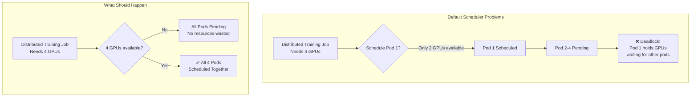

**Key Limitations:**

| Problem | Description | Impact |
|---------|-------------|--------|
| **No Gang Scheduling** | Pods scheduled independently | Partial allocation wastes GPUs, causes deadlocks |
| **No Topology Awareness** | Ignores NVLink/NVSwitch fabric | 10x performance degradation when GPUs cross PCIe |
| **Whole GPU Allocation** | Cannot share GPUs between workloads | 70-80% GPU underutilization for inference |
| **Basic Priority** | Limited preemption capabilities | Cannot prioritize urgent inference over training |
| **No Queue Management** | First-come-first-served | No resource fairness across teams |

### 1.2 The GPU Utilization Problem

Enterprise GPU clusters commonly see 30-50% average utilization because:

1. **Memory Fragmentation**: A workload needing 12GB cannot use a 16GB GPU that has 14GB free
2. **Batch Size Mismatch**: Inference workloads often need <1 GPU but get allocated entire GPUs
3. **Idle Time**: Training jobs have preprocessing phases where GPUs sit idle
4. **Scheduling Gaps**: Time between job completion and next job scheduling

---

## 2. Advanced GPU Schedulers

### 2.1 KAI Scheduler (NVIDIA Open Source)

KAI Scheduler is an open-source GPU-aware Kubernetes scheduler developed by NVIDIA. It was originally built as the core scheduler in the Run:AI platform; after NVIDIA acquired Run:AI, the scheduler was open-sourced under the Apache 2.0 license. KAI addresses all the limitations of the default Kubernetes scheduler for AI workloads.

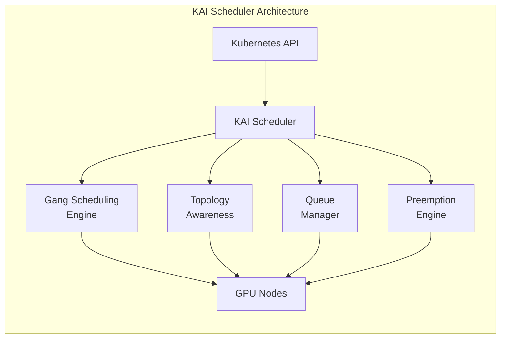

**Core Capabilities:**

| Feature | Description |
|---------|-------------|
| **Gang Scheduling** | All-or-nothing scheduling for distributed jobs |
| **Topology Awareness** | Schedules pods to maximize NVLink connectivity |
| **Priority Queues** | Hierarchical resource allocation with fairness |
| **Preemption** | Higher priority jobs can evict lower priority jobs |
| **Bin Packing** | Efficiently packs workloads to maximize utilization |
| **Time Slicing** | Multiple workloads share a GPU via time-division |

### 2.2 Other GPU Schedulers

| Scheduler | Source | Key Features | Best For |
|-----------|--------|--------------|----------|
| **KAI Scheduler** | NVIDIA Open Source (Apache 2.0) | Full-featured, production-ready | Enterprise Kubernetes |
| **Run:AI** | NVIDIA Commercial | KAI core + UI, analytics, enterprise features | Enterprise with support needs |
| **Volcano** | CNCF | Batch scheduling, gang scheduling | HPC-style batch workloads |
| **Kueue** | Kubernetes SIG | Queue management, resource quotas | Multi-tenant clusters |
| **Yunikorn** | Apache | Hierarchical queues, gang scheduling | Spark/Big Data + AI |

---

## 3. Gang Scheduling Deep Dive

### 3.1 Why Gang Scheduling Matters

Distributed training jobs (using frameworks like PyTorch DDP, Horovod, or DeepSpeed) require multiple processes to start simultaneously. Without gang scheduling:

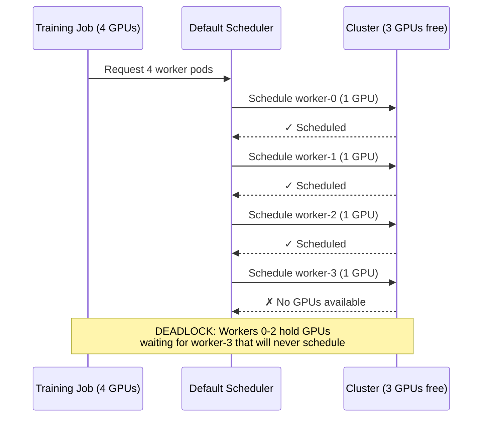

**With Gang Scheduling:**

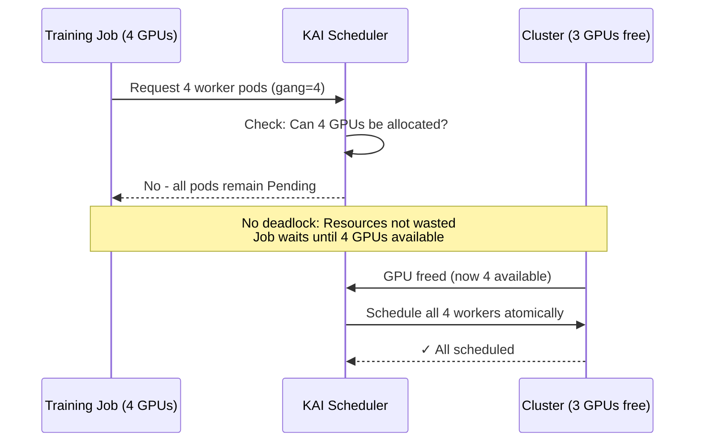

### 3.2 Gang Scheduling Configuration

```yaml
apiVersion: batch/v1
kind: Job
metadata:
  name: distributed-training
spec:
  parallelism: 4
  completions: 4
  template:
    metadata:
      labels:
        # KAI Scheduler assigns pods to queues via labels
        kai.scheduler/queue: training-queue
    spec:
      schedulerName: kai-scheduler
      containers:
        - name: worker
          image: pytorch/pytorch:2.1.0-cuda12.1-cudnn8-runtime
          resources:
            limits:
              nvidia.com/gpu: 1
```

> **How KAI Gang Scheduling Works:** KAI Scheduler automatically groups pods belonging to the same Job or PodGroup and applies gang scheduling semantics. You do not need manual annotations -- the scheduler's PodGrouper detects related pods and ensures all-or-nothing scheduling.


### 3.3 Gang Scheduling Algorithms

| Algorithm | Description | Trade-offs |
|-----------|-------------|------------|
| **Coscheduling** | Wait for all resources, then schedule atomically | Simple, may cause starvation |
| **Optimistic Gang** | Schedule if likely to complete, backfill if fails | Better utilization, more complexity |
| **Preemptive Gang** | Preempt lower priority jobs to make room | Fastest scheduling, may cause thrashing |

---

## 4. Priority and Preemption

### 4.1 Priority Classes for AI Workloads

A well-designed priority system enables efficient multi-tenant GPU clusters:

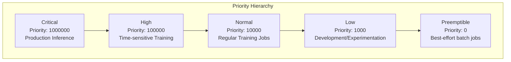

**Priority Class Definitions:**

```yaml
apiVersion: scheduling.k8s.io/v1
kind: PriorityClass
metadata:
  name: ai-critical
value: 1000000
preemptionPolicy: PreemptLowerPriority
globalDefault: false
description: "Production inference - highest priority"
---
apiVersion: scheduling.k8s.io/v1
kind: PriorityClass
metadata:
  name: ai-training-high
value: 100000
preemptionPolicy: PreemptLowerPriority
description: "Time-sensitive training jobs"
---
apiVersion: scheduling.k8s.io/v1
kind: PriorityClass
metadata:
  name: ai-training-normal
value: 10000
preemptionPolicy: PreemptLowerPriority
globalDefault: true
description: "Regular training workloads"
---
apiVersion: scheduling.k8s.io/v1
kind: PriorityClass
metadata:
  name: ai-dev
value: 1000
preemptionPolicy: Never
description: "Development - won't preempt others"
```

### 4.2 Preemption Flow

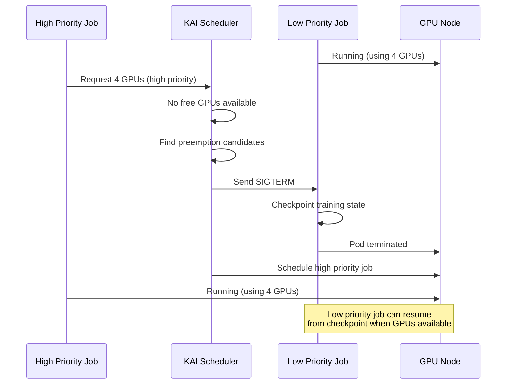

**Preemption Best Practices:**

1. **Graceful Termination**: Set `terminationGracePeriodSeconds` to allow checkpointing
2. **Checkpoint Strategy**: Training jobs should checkpoint every N epochs
3. **Priority Gaps**: Leave gaps between priorities (1000, 10000, 100000) for future levels
4. **Non-preempting Dev**: Development jobs should use `preemptionPolicy: Never`

---

## 5. Fractional GPU Allocation

### 5.1 The Underutilization Problem

Many AI workloads don't need a full GPU:

| Workload Type | Typical GPU Memory | Typical GPU Compute |
|---------------|-------------------|---------------------|
| Small model inference | 2-4 GB | 10-30% |
| Jupyter notebooks (dev) | 1-8 GB | 5-20% |
| Data preprocessing | 0-2 GB | 0-10% |
| Large model inference | 16-80 GB | 40-80% |
| Training | 16-80 GB | 80-100% |

### 5.2 Fractional GPU Strategies

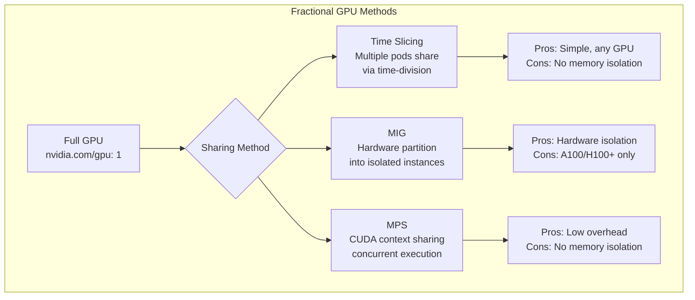

### 5.3 Time Slicing Configuration

Time slicing allows multiple pods to share a physical GPU through time-division multiplexing:

```yaml
# GPU Operator ConfigMap for time-slicing
apiVersion: v1
kind: ConfigMap
metadata:
  name: time-slicing-config
  namespace: gpu-operator
data:
  any: |-
    version: v1
    flags:
      migStrategy: none
    sharing:
      timeSlicing:
        renameByDefault: false
        failRequestsGreaterThanOne: false
        resources:
          - name: nvidia.com/gpu
            replicas: 4  # Each physical GPU appears as 4 virtual GPUs
```

**Time Slicing Limitations:**

- No memory isolation between workloads
- Total memory requests cannot exceed physical GPU memory
- Context switching overhead (5-15%)
- Not suitable for latency-sensitive inference

### 5.4 Multi-Instance GPU (MIG)

MIG provides hardware-level GPU partitioning on A30, A100, H100, H200, B200,
GB200, and newer data-center GPUs. Two clarifications up front, because both are
common sources of confusion:

- **MIG requires no license.** It is a feature of the GPU and the datacenter
  driver. This is unlike Run:ai fractional GPUs (commercial license, Lab 5.4) and
  unlike vGPU.
- **MIG is not vGPU.** vGPU time-slices a GPU across *virtual machines* and
  **does** require an NVIDIA vGPU / AI Enterprise license. MIG partitions a GPU
  in *hardware* and is consumed directly by containers. The two can be combined
  as MIG-backed vGPU, which then requires the vGPU license.
- **Many GPUs cannot do MIG at all.** A10G, L4, L40S, and T4 have no MIG support
  at any driver version. This is why Week 5's standard `g5.12xlarge` worker
  (4x A10G) cannot run MIG, and why Lab 5.19 requires `p4d.24xlarge`.

#### The two-level model: GPU Instances and Compute Instances

MIG partitions along two axes, and the profile names encode both:

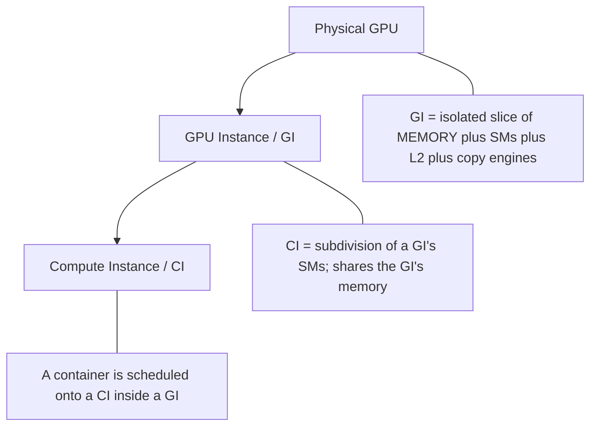

A **GPU Instance** is the unit of hardware isolation: it owns dedicated memory,
streaming multiprocessors, L2 cache slices, and copy engines. A **Compute
Instance** subdivides a GI's compute while still sharing that GI's memory. Full
fault and memory isolation is a property of the GI boundary, not the CI boundary.

#### Slice arithmetic — why profiles are not freely composable

A GPU exposes a fixed budget of **compute slices** and **memory slices**. On both
A100 and H100 that budget is **7 compute slices and 8 memory slices**. A profile
named `<N>g.<M>gb` consumes `N` compute slices and however many memory slices add
up to `M` GB.

Memory slice size is what differs by SKU — and it is the detail that trips people
up:

| GPU | Memory | Memory slice size | `1g.10gb` costs | Max `1g.10gb` |
|-----|--------|-------------------|-----------------|---------------|
| A100 40GB | 40 GB | 5 GB | 1 compute + **2** memory | **4** |
| A100 80GB / H100 80GB | 80 GB | 10 GB | 1 compute + **1** memory | **7** |

**The same profile name means different things on different SKUs.** A config that
requests seven `1g.10gb` instances is valid on an 80GB GPU and *impossible* on a
40GB A100, where the memory budget caps it at four. `mig-parted` rejects the
geometry rather than silently degrading.

#### Profiles on A100 40GB — the Lab 5.19 hardware

`p4d.24xlarge` provides 8x A100-SXM4-**40GB**:

| Profile | Compute slices | Memory | Max instances | Limited by |
|---------|---------------|--------|---------------|------------|
| `1g.5gb` | 1 | 5 GB | 7 | compute (7/1) |
| `1g.10gb` | 1 | 10 GB | 4 | memory (8/2) |
| `2g.10gb` | 2 | 10 GB | 3 | compute (7/2) |
| `3g.20gb` | 3 | 20 GB | 2 | both |
| `4g.20gb` | 4 | 20 GB | 1 | compute |
| `7g.40gb` | 7 | 40 GB | 1 | both (whole GPU) |

#### Profiles on 80GB-class GPUs — A100 80GB, H100, H200

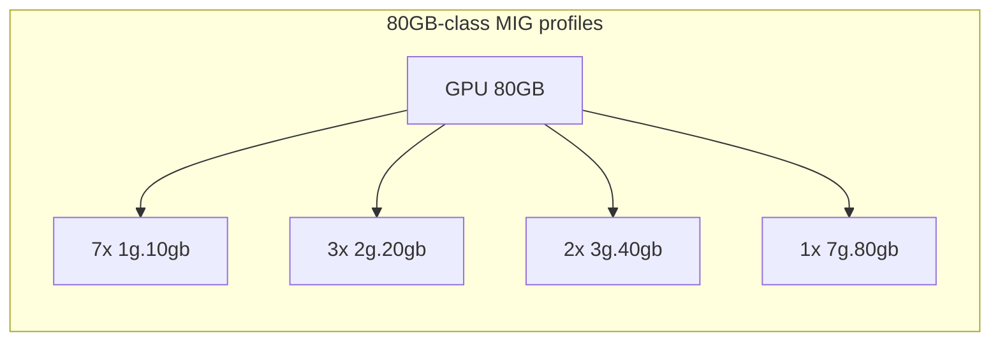

| Profile | Compute slices | Memory | Max instances |
|---------|---------------|--------|---------------|
| `1g.10gb` | 1 | 10 GB | 7 |
| `1g.20gb` | 1 | 20 GB | 4 |
| `2g.20gb` | 2 | 20 GB | 3 |
| `3g.40gb` | 3 | 40 GB | 2 |
| `4g.40gb` | 4 | 40 GB | 1 |
| `7g.80gb` | 7 | 80 GB | 1 |

#### MIG configuration

The GPU Operator's MIG manager reads named layouts from a `mig-parted` ConfigMap
and applies whichever one a node's `nvidia.com/mig.config` label selects.

**You usually do not need to write one.** The operator ships
`default-mig-parted-config` with roughly 80 predefined layouts spanning every
MIG-capable SKU. Entries are filtered by PCI device ID, so one layout name can
resolve to different geometries per GPU — `all-1g.10gb` yields 7 instances on an
80GB part and 4 on a 40GB A100, from the same key. The predefined names are `all-*`
only, and they include `all-balanced`, which on A100 40GB gives a fully saturated
mixed layout of 2x `1g.5gb` + 1x `2g.10gb` + 1x `3g.20gb` (7 of 7 compute slices,
8 of 8 memory slices).

Write a custom ConfigMap only when you need a geometry the defaults do not offer,
and point `migManager.config.name` at it. The example below shows that shape — the
names in it are **custom**, not shipped:

**For A100 40GB** (valid on the Lab 5.19 hardware):

```yaml
apiVersion: v1
kind: ConfigMap
metadata:
  name: mig-parted-config
  namespace: gpu-operator
data:
  config.yaml: |
    version: v1
    mig-configs:
      # Maximum density for small inference: 7 slices per GPU
      all-1g.5gb:
        - devices: all
          mig-enabled: true
          mig-devices:
            "1g.5gb": 7

      # Mixed geometry: 2 medium + 1 small.
      # Costs 2x2 + 1x1 = 5 compute and 2x2 + 1x1 = 5 memory slices.
      mixed-inference:
        - devices: all
          mig-enabled: true
          mig-devices:
            "2g.10gb": 2
            "1g.5gb": 1

      # Two large instances for training
      training-3g.20gb:
        - devices: all
          mig-enabled: true
          mig-devices:
            "3g.20gb": 2

      # MIG disabled: GPU behaves as one whole device again
      all-disabled:
        - devices: all
          mig-enabled: false
```

**For 80GB-class GPUs**, substitute the profile names from the table above -- for
example `"1g.10gb": 7`, or `"2g.20gb": 3` plus `"1g.10gb": 1`. Copying an
80GB layout onto a 40GB A100 fails geometry validation.

#### Reconfiguration is a node-level operation

Changing a MIG layout requires **resetting the GPU**, which means no CUDA context
may be open on it. In practice the GPU Operator's MIG manager must drain GPU pods
from the node, reset the devices, and let the device plugin re-advertise the new
resources. Consequences worth designing around:

- Reconfiguration is disruptive to workloads on that node -- it is a maintenance
  operation, not something a scheduler does per-pod.
- Anything caching the old device list must be refreshed. The NVIDIA DRA driver's
  kubelet plugin is a documented example: if it was deployed before a MIG change
  it must be restarted, or its `ResourceSlice` objects go stale.
- Because layout is per-node, heterogeneous partitioning across a fleet is
  expressed with node labels and node pools, not with pod specs.

**MIG vs Time Slicing:**

| Feature | MIG | Time Slicing |
|---------|-----|--------------|
| Memory Isolation | Hardware | None |
| Compute Isolation | Hardware | Time-division |
| Supported GPUs | A30, A100, H100, H200, B200, GB200 | All NVIDIA GPUs |
| Overhead | Near-zero | 5-15% |
| Reconfiguration | Requires GPU reset | Dynamic |
| Fault Isolation | Yes | No |
| License | None | None |

> **Hands-on:** [Lab 5.19 - MIG Partitioning](../labs/lab-5.19-mig-partitioning.md)
> applies all of the above on `p4d.24xlarge`: enabling MIG, both device-plugin
> strategies, proving memory isolation, allocating slices through DRA, and
> reverting.

---

## 6. GPU Topology Awareness

### 6.1 Why Topology Matters

In multi-GPU systems, not all GPU pairs have equal connectivity:

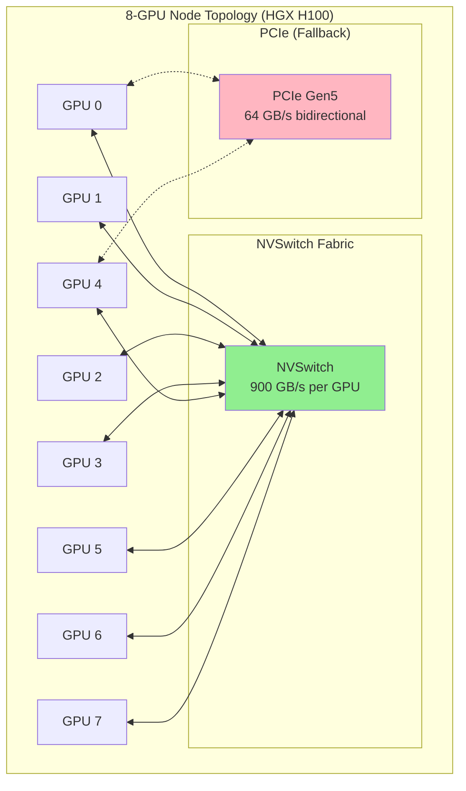

**Bandwidth Comparison:**

| Connection Type | Bandwidth | Latency | Use Case |
|----------------|-----------|---------|----------|
| NVLink 4.0 (H100) | 900 GB/s | ~1 μs | Intra-node tensor parallelism |
| NVLink 5.0 (B200) | 1.8 TB/s | <1 μs | Intra-node tensor parallelism |
| PCIe Gen5 x16 | 64 GB/s per direction | ~2-5 μs | CPU-GPU, cross-socket |
| InfiniBand NDR | 400 Gb/s | ~1-2 μs | Inter-node communication |
| Ethernet 100GbE | 100 Gb/s | ~5-10 μs | General networking |

### 6.2 Topology-Aware Scheduling

A topology-aware scheduler ensures distributed training jobs are placed to maximize NVLink usage:

```yaml
apiVersion: batch/v1
kind: Job
metadata:
  name: topology-aware-training
spec:
  template:
    metadata:
      labels:
        kai.scheduler/queue: training-queue
    spec:
      schedulerName: kai-scheduler
      affinity:
        nodeAffinity:
          requiredDuringSchedulingIgnoredDuringExecution:
            nodeSelectorTerms:
              - matchExpressions:
                  - key: nvidia.com/gpu.product
                    operator: In
                    values:
                      - NVIDIA-H100-80GB-HBM3
      containers:
        - name: trainer
          resources:
            limits:
              nvidia.com/gpu: 4
```

> **Topology-Aware Scheduling (TAS):** KAI Scheduler v0.10.0+ includes topology-aware scheduling that automatically optimizes pod placement for NVLink connectivity. Combined with `nodeAffinity` to target specific GPU types, this ensures distributed training pods are co-located on NVLink-connected GPUs. The scheduler reads GPU topology from node labels applied by GPU Feature Discovery.


### 6.3 Verifying GPU Topology

Use `nvidia-smi topo -m` to understand your cluster's topology:

```
        GPU0    GPU1    GPU2    GPU3    GPU4    GPU5    GPU6    GPU7
GPU0     X      NV18    NV18    NV18    NV18    NV18    NV18    NV18
GPU1    NV18     X      NV18    NV18    NV18    NV18    NV18    NV18
GPU2    NV18    NV18     X      NV18    NV18    NV18    NV18    NV18
GPU3    NV18    NV18    NV18     X      NV18    NV18    NV18    NV18
GPU4    NV18    NV18    NV18    NV18     X      NV18    NV18    NV18
GPU5    NV18    NV18    NV18    NV18    NV18     X      NV18    NV18
GPU6    NV18    NV18    NV18    NV18    NV18    NV18     X      NV18
GPU7    NV18    NV18    NV18    NV18    NV18    NV18    NV18     X

Legend:
  NV18 = 18 NVLinks (H100 full NVSwitch connectivity, 900 GB/s per GPU)
  NV12 = 12 NVLinks (A100 full NVSwitch connectivity, 600 GB/s per GPU)
  SYS  = System/PCIe connection
  PHB  = PCIe Host Bridge
```

---

## 7. Queue Management

### 7.1 Resource Queues for Multi-Tenancy

Queues provide fair resource allocation across teams:

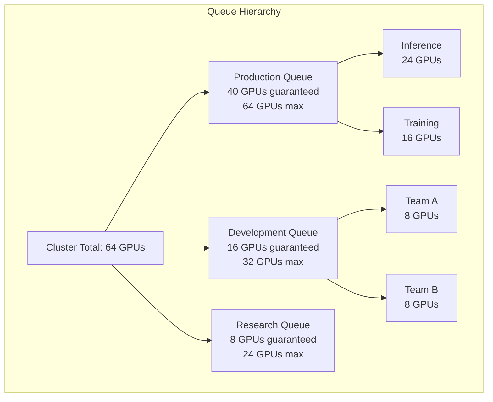

### 7.2 Queue Configuration

```yaml
apiVersion: scheduling.run.ai/v2
kind: Queue
metadata:
  name: production-inference
spec:
  # Resource guarantees (minimum guaranteed allocation)
  resources:
    gpu:
      quota: 40
      overQuotaWeight: 100
  # Parent queue for hierarchy
  parentQueue: production
  # Priority (higher = scheduled first when competing)
  priority: 150
---
apiVersion: scheduling.run.ai/v2
kind: Queue
metadata:
  name: development
spec:
  resources:
    gpu:
      quota: 16
      overQuotaWeight: 50
  priority: 50
```

> **Note:** KAI Scheduler uses the `scheduling.run.ai/v2` API group (inherited from its Run:AI origins). Queue resources define GPU quotas and over-quota weights that control fair-sharing behavior when the cluster is oversubscribed.


---

## 8. Key Takeaways

### GPU Scheduling Principles

1. **Gang Scheduling is Essential**: Distributed training requires all-or-nothing scheduling
2. **Topology Awareness Matters**: 10x performance difference between NVLink and PCIe
3. **Fractional Sharing Improves Utilization**: Use MIG for isolation, time-slicing for flexibility
4. **Priority Enables Multi-tenancy**: Production inference should preempt development training
5. **Queues Provide Fairness**: Guarantee resources to teams while allowing burst capacity

### Scheduler Selection Guide

| Requirement | Recommended Scheduler |
|-------------|----------------------|
| Basic GPU scheduling | Default + GPU Operator |
| Gang scheduling only | Volcano or Kueue |
| Full AI platform features | KAI Scheduler or Run:AI |
| Spark + AI mixed workloads | Yunikorn |
| Enterprise support required | Run:AI (commercial) |

---

## 9. GPU Scheduling in k0rdent Enterprise

### 9.1 How k0rdent Delivers GPU Infrastructure

In the k0rdent Enterprise model (established in Week 1), GPU-related components are deployed as **ServiceTemplates** from the [k0rdent catalog](https://catalog.k0rdent.io/). This is the same pattern used for cert-manager, ingress-nginx, and kyverno in Lab 1.7.

```
┌───────────────────────────────────────────────────┐
│              Management Cluster (k0s)              │
│                                                    │
│  ServiceTemplates (kcm-system namespace):          │
│  ├── gpu-operator-25-10-0                          │
│  ├── kserve-*                                      │
│  ├── milvus-*                                      │
│  └── mlflow-*                                      │
│                                                    │
│  ClusterDeployment ──► Managed GPU Cluster         │
│    └── serviceSpec.services:                       │
│        ├── gpu-operator (from catalog)             │
│        └── (additional AI services)                │
└───────────────────────────────────────────────────┘
```

**Key points for k0rdent engineers:**

1. **NVIDIA GPU Operator** is a validated catalog entry (`gpu-operator-25-10-0`). Deploy it via `ClusterDeployment.spec.serviceSpec.services[]` or `MultiClusterService`, not via manual `helm install`.
2. **k0s containerd paths** differ from standard Kubernetes: the GPU Operator toolkit must target `/etc/k0s/containerd.d/nvidia.toml` (config) and `/run/k0s/containerd.sock` (socket). This is configured via the NVIDIA partner-validated Helm values.
3. **KAI Scheduler** is deployed directly to GPU clusters (not as a catalog ServiceTemplate), since it requires per-cluster scheduling configuration.
4. **Run:AI control plane** (`runai-cp`) is available in the k0rdent catalog for enterprise GPU orchestration.

### 9.2 Catalog Services Relevant to Week 5

| Catalog Entry | Description | Used In |
|---------------|-------------|---------|
| `nvidia` (gpu-operator) | GPU drivers, device plugin, DCGM | Lab 5.1 (prerequisite) |
| `kserve` | Model serving platform | Alternative to raw vLLM |
| `milvus` | Vector database | Lab 5.3 |
| `mlflow` | Experiment tracking | Lab 5.10 |
| `jupyterhub` | Notebook environments | Lab 5.4 |
| `kuberay` | Ray cluster management | Distributed AI |
| `runai-cp` | Run:AI control plane | Lab 5.11 |

---

## References

- [KAI Scheduler GitHub](https://github.com/kai-scheduler/KAI-Scheduler)
- [KAI Scheduler on NGC](https://catalog.ngc.nvidia.com/orgs/nvidia/teams/k8s/helm-charts/kai-scheduler)
- [NVIDIA Open Sources Run:AI Scheduler](https://developer.nvidia.com/blog/nvidia-open-sources-runai-scheduler-to-foster-community-collaboration/)
- [Volcano Scheduler](https://volcano.sh/)
- [Kueue Documentation](https://kueue.sigs.k8s.io/)
- [NVIDIA GPU Operator](https://docs.nvidia.com/datacenter/cloud-native/gpu-operator/)
- [NVIDIA GPU Operator - k0rdent Partner Validation](https://docs.nvidia.com/datacenter/cloud-native/partner-validated/latest/k0rdent.html)
- [k0rdent Service Catalog](https://catalog.k0rdent.io/)
- [Kubernetes Priority and Preemption](https://kubernetes.io/docs/concepts/scheduling-eviction/pod-priority-preemption/)
- [MIG User Guide](https://docs.nvidia.com/datacenter/tesla/mig-user-guide/)
