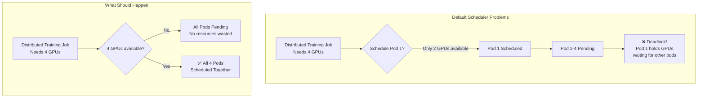
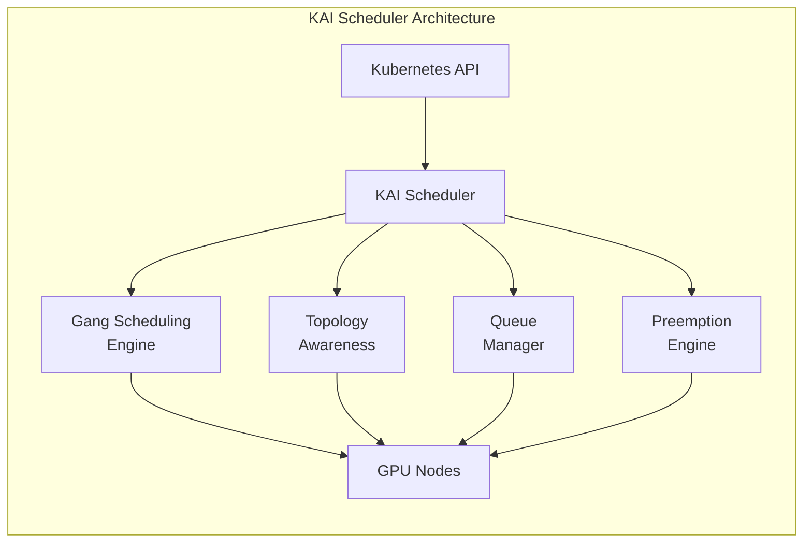
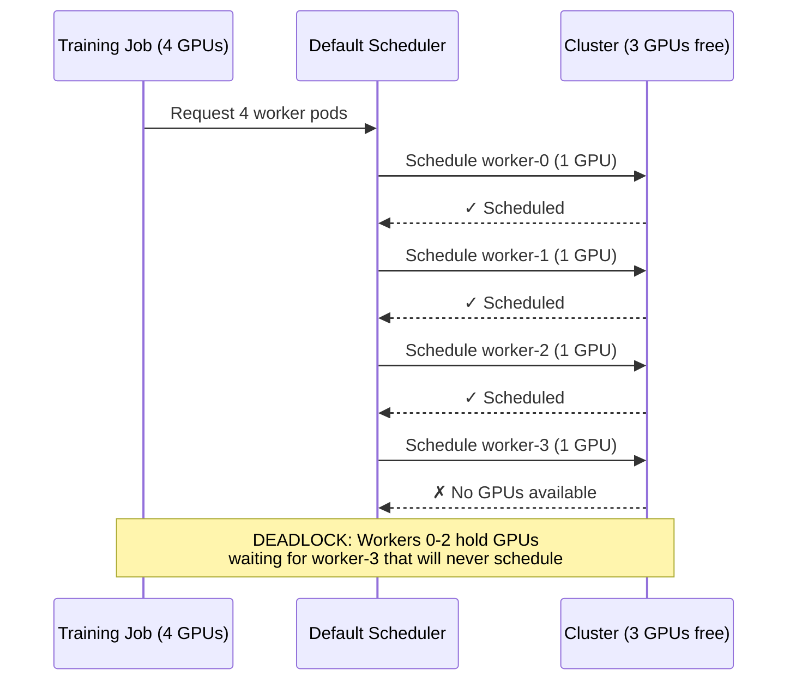
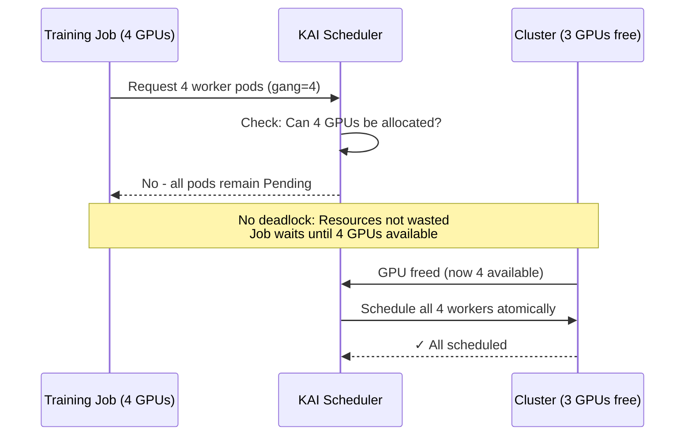
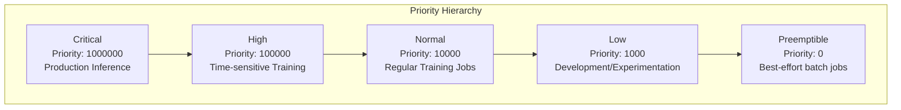
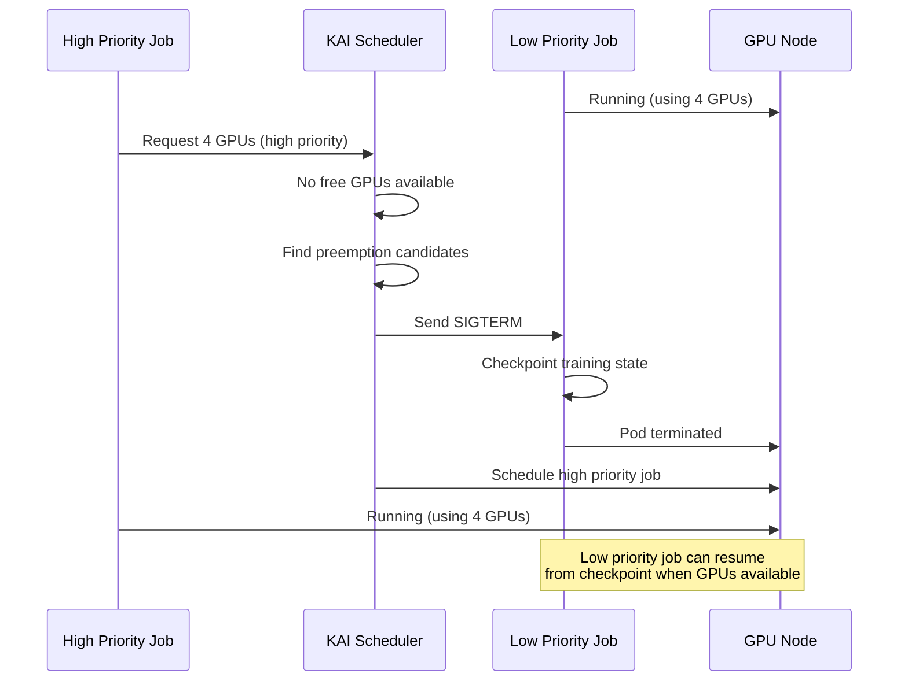
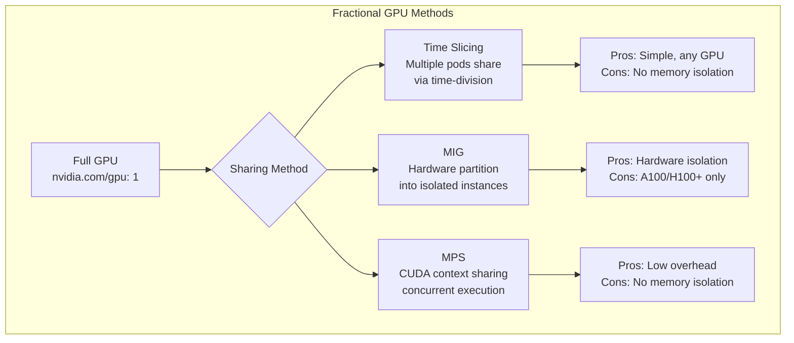
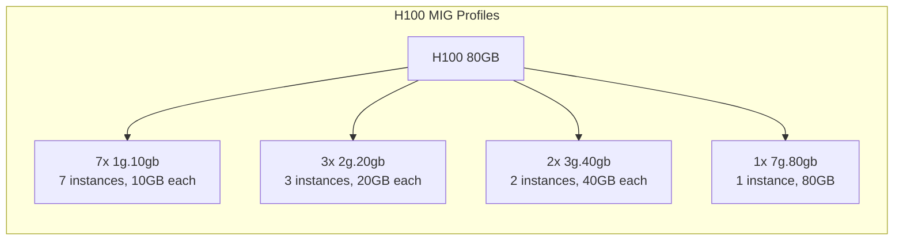
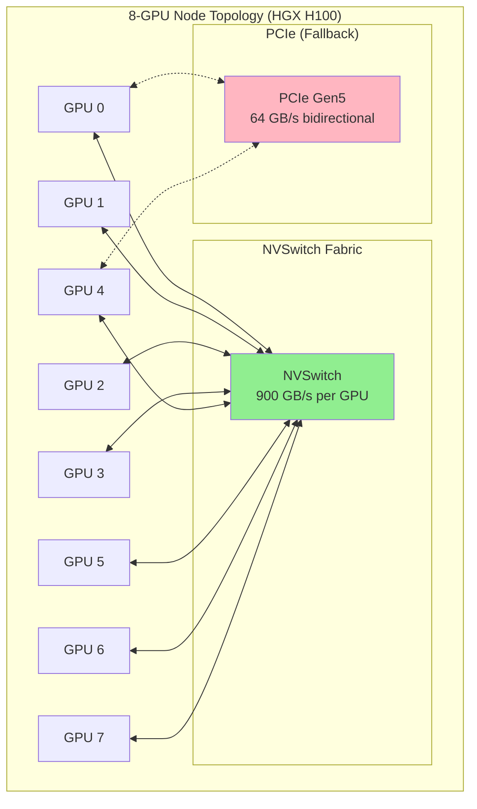
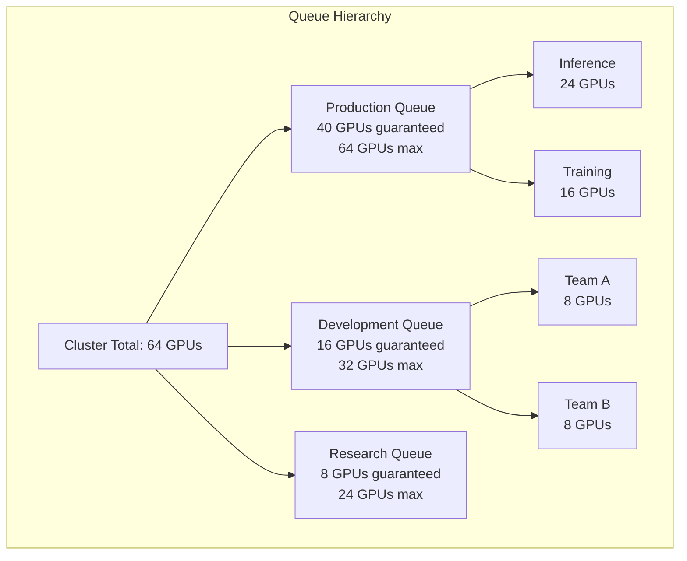

# 5.1 GPU Scheduling for AI Workloads

**Duration:** 1.5 hours
**Type:** Theory / Reading

## Learning Objectives

By the end of this module, you will be able to:

- [ ] Explain why the default Kubernetes scheduler is insufficient for GPU workloads
- [ ] Describe gang scheduling and its importance for distributed training
- [ ] Configure priority queues and preemption for multi-tenant GPU clusters
- [ ] Understand fractional GPU allocation strategies (time-slicing, MIG)
- [ ] Explain GPU topology awareness and its impact on training performance

---

## 1. The GPU Scheduling Challenge

### 1.1 Default Kubernetes Scheduler Limitations

The default Kubernetes scheduler was designed for general-purpose workloads and treats GPUs as simple countable resources. This creates several critical problems for AI workloads:



**Key Limitations:**

| Problem | Description | Impact |
|---------|-------------|--------|
| **No Gang Scheduling** | Pods scheduled independently | Partial allocation wastes GPUs, causes deadlocks |
| **No Topology Awareness** | Ignores NVLink/NVSwitch fabric | 10x performance degradation when GPUs cross PCIe |
| **Whole GPU Allocation** | Cannot share GPUs between workloads | 70-80% GPU underutilization for inference |
| **Basic Priority** | Limited preemption capabilities | Cannot prioritize urgent inference over training |
| **No Queue Management** | First-come-first-served | No resource fairness across teams |

### 1.2 The GPU Utilization Problem

Enterprise GPU clusters commonly see 30-50% average utilization because:

1. **Memory Fragmentation**: A workload needing 12GB cannot use a 16GB GPU that has 14GB free
2. **Batch Size Mismatch**: Inference workloads often need <1 GPU but get allocated entire GPUs
3. **Idle Time**: Training jobs have preprocessing phases where GPUs sit idle
4. **Scheduling Gaps**: Time between job completion and next job scheduling

---

## 2. Advanced GPU Schedulers

### 2.1 KAI Scheduler (Open Source Run:AI)

KAI Scheduler is an open-source Kubernetes scheduler designed specifically for AI workloads. It addresses all the limitations of the default scheduler.



**Core Capabilities:**

| Feature | Description |
|---------|-------------|
| **Gang Scheduling** | All-or-nothing scheduling for distributed jobs |
| **Topology Awareness** | Schedules pods to maximize NVLink connectivity |
| **Priority Queues** | Hierarchical resource allocation with fairness |
| **Preemption** | Higher priority jobs can evict lower priority jobs |
| **Bin Packing** | Efficiently packs workloads to maximize utilization |
| **Time Slicing** | Multiple workloads share a GPU via time-division |

### 2.2 Other GPU Schedulers

| Scheduler | Source | Key Features | Best For |
|-----------|--------|--------------|----------|
| **KAI Scheduler** | Open Source (Run:AI fork) | Full-featured, production-ready | Enterprise Kubernetes |
| **Run:AI** | Commercial | KAI + UI, analytics, advanced features | Enterprise with support needs |
| **Volcano** | CNCF | Batch scheduling, gang scheduling | HPC-style batch workloads |
| **Kueue** | Kubernetes SIG | Queue management, resource quotas | Multi-tenant clusters |
| **Yunikorn** | Apache | Hierarchical queues, gang scheduling | Spark/Big Data + AI |

---

## 3. Gang Scheduling Deep Dive

### 3.1 Why Gang Scheduling Matters

Distributed training jobs (using frameworks like PyTorch DDP, Horovod, or DeepSpeed) require multiple processes to start simultaneously. Without gang scheduling:



**With Gang Scheduling:**



### 3.2 Gang Scheduling Configuration

```yaml
apiVersion: batch/v1
kind: Job
metadata:
  name: distributed-training
  annotations:
    # KAI Scheduler gang scheduling annotations
    kai.io/gang-scheduling: "true"
    kai.io/gang-size: "4"
spec:
  parallelism: 4
  completions: 4
  template:
    spec:
      schedulerName: kai-scheduler
      containers:
        - name: worker
          image: pytorch/pytorch:2.1.0-cuda12.1-cudnn8-runtime
          resources:
            limits:
              nvidia.com/gpu: 1
```

### 3.3 Gang Scheduling Algorithms

| Algorithm | Description | Trade-offs |
|-----------|-------------|------------|
| **Coscheduling** | Wait for all resources, then schedule atomically | Simple, may cause starvation |
| **Optimistic Gang** | Schedule if likely to complete, backfill if fails | Better utilization, more complexity |
| **Preemptive Gang** | Preempt lower priority jobs to make room | Fastest scheduling, may cause thrashing |

---

## 4. Priority and Preemption

### 4.1 Priority Classes for AI Workloads

A well-designed priority system enables efficient multi-tenant GPU clusters:



**Priority Class Definitions:**

```yaml
apiVersion: scheduling.k8s.io/v1
kind: PriorityClass
metadata:
  name: ai-critical
value: 1000000
preemptionPolicy: PreemptLowerPriority
globalDefault: false
description: "Production inference - highest priority"
---
apiVersion: scheduling.k8s.io/v1
kind: PriorityClass
metadata:
  name: ai-training-high
value: 100000
preemptionPolicy: PreemptLowerPriority
description: "Time-sensitive training jobs"
---
apiVersion: scheduling.k8s.io/v1
kind: PriorityClass
metadata:
  name: ai-training-normal
value: 10000
preemptionPolicy: PreemptLowerPriority
globalDefault: true
description: "Regular training workloads"
---
apiVersion: scheduling.k8s.io/v1
kind: PriorityClass
metadata:
  name: ai-dev
value: 1000
preemptionPolicy: Never
description: "Development - won't preempt others"
```

### 4.2 Preemption Flow



**Preemption Best Practices:**

1. **Graceful Termination**: Set `terminationGracePeriodSeconds` to allow checkpointing
2. **Checkpoint Strategy**: Training jobs should checkpoint every N epochs
3. **Priority Gaps**: Leave gaps between priorities (1000, 10000, 100000) for future levels
4. **Non-preempting Dev**: Development jobs should use `preemptionPolicy: Never`

---

## 5. Fractional GPU Allocation

### 5.1 The Underutilization Problem

Many AI workloads don't need a full GPU:

| Workload Type | Typical GPU Memory | Typical GPU Compute |
|---------------|-------------------|---------------------|
| Small model inference | 2-4 GB | 10-30% |
| Jupyter notebooks (dev) | 1-8 GB | 5-20% |
| Data preprocessing | 0-2 GB | 0-10% |
| Large model inference | 16-80 GB | 40-80% |
| Training | 16-80 GB | 80-100% |

### 5.2 Fractional GPU Strategies



### 5.3 Time Slicing Configuration

Time slicing allows multiple pods to share a physical GPU through time-division multiplexing:

```yaml
# GPU Operator ConfigMap for time-slicing
apiVersion: v1
kind: ConfigMap
metadata:
  name: time-slicing-config
  namespace: gpu-operator
data:
  any: |-
    version: v1
    flags:
      migStrategy: none
    sharing:
      timeSlicing:
        renameByDefault: false
        failRequestsGreaterThanOne: false
        resources:
          - name: nvidia.com/gpu
            replicas: 4  # Each physical GPU appears as 4 virtual GPUs
```

**Time Slicing Limitations:**

- No memory isolation between workloads
- Total memory requests cannot exceed physical GPU memory
- Context switching overhead (5-15%)
- Not suitable for latency-sensitive inference

### 5.4 Multi-Instance GPU (MIG)

MIG provides hardware-level GPU partitioning on A100, H100, H200, and newer GPUs:



**MIG Configuration:**

```yaml
apiVersion: v1
kind: ConfigMap
metadata:
  name: mig-parted-config
  namespace: gpu-operator
data:
  config.yaml: |
    version: v1
    mig-configs:
      # 7 small instances for inference
      all-1g.10gb:
        - devices: all
          mig-enabled: true
          mig-devices:
            "1g.10gb": 7

      # Mixed: 3 medium + 1 small
      mixed-inference:
        - devices: all
          mig-enabled: true
          mig-devices:
            "2g.20gb": 3
            "1g.10gb": 1

      # 2 large instances for training
      training-3g.40gb:
        - devices: all
          mig-enabled: true
          mig-devices:
            "3g.40gb": 2
```

**MIG vs Time Slicing:**

| Feature | MIG | Time Slicing |
|---------|-----|--------------|
| Memory Isolation | Hardware | None |
| Compute Isolation | Hardware | Time-division |
| Supported GPUs | A100, H100, H200, B200 | All NVIDIA GPUs |
| Overhead | Near-zero | 5-15% |
| Reconfiguration | Requires GPU reset | Dynamic |
| Fault Isolation | Yes | No |

---

## 6. GPU Topology Awareness

### 6.1 Why Topology Matters

In multi-GPU systems, not all GPU pairs have equal connectivity:



**Bandwidth Comparison:**

| Connection Type | Bandwidth | Latency | Use Case |
|----------------|-----------|---------|----------|
| NVLink 4.0 (H100) | 900 GB/s | ~1 μs | Intra-node tensor parallelism |
| NVLink 5.0 (B200) | 1.8 TB/s | <1 μs | Intra-node tensor parallelism |
| PCIe Gen5 x16 | 64 GB/s | ~2-5 μs | CPU-GPU, cross-socket |
| InfiniBand NDR | 400 Gb/s | ~1-2 μs | Inter-node communication |
| Ethernet 100GbE | 100 Gb/s | ~5-10 μs | General networking |

### 6.2 Topology-Aware Scheduling

A topology-aware scheduler ensures distributed training jobs are placed to maximize NVLink usage:

```yaml
apiVersion: batch/v1
kind: Job
metadata:
  name: topology-aware-training
  annotations:
    kai.io/topology-aware: "true"
    kai.io/preferred-topology: "NVLink"
spec:
  template:
    spec:
      schedulerName: kai-scheduler
      affinity:
        nodeAffinity:
          requiredDuringSchedulingIgnoredDuringExecution:
            nodeSelectorTerms:
              - matchExpressions:
                  - key: nvidia.com/gpu.product
                    operator: In
                    values:
                      - NVIDIA-H100-80GB-HBM3
      containers:
        - name: trainer
          resources:
            limits:
              nvidia.com/gpu: 4
```

### 6.3 Verifying GPU Topology

Use `nvidia-smi topo -m` to understand your cluster's topology:

```
        GPU0    GPU1    GPU2    GPU3    GPU4    GPU5    GPU6    GPU7
GPU0     X      NV12    NV12    NV12    NV12    NV12    NV12    NV12
GPU1    NV12     X      NV12    NV12    NV12    NV12    NV12    NV12
GPU2    NV12    NV12     X      NV12    NV12    NV12    NV12    NV12
GPU3    NV12    NV12    NV12     X      NV12    NV12    NV12    NV12
GPU4    NV12    NV12    NV12    NV12     X      NV12    NV12    NV12
GPU5    NV12    NV12    NV12    NV12    NV12     X      NV12    NV12
GPU6    NV12    NV12    NV12    NV12    NV12    NV12     X      NV12
GPU7    NV12    NV12    NV12    NV12    NV12    NV12    NV12     X

Legend:
  NV12 = 12 NVLinks (full NVSwitch connectivity)
  SYS  = System/PCIe connection
  PHB  = PCIe Host Bridge
```

---

## 7. Queue Management

### 7.1 Resource Queues for Multi-Tenancy

Queues provide fair resource allocation across teams:



### 7.2 Queue Configuration

```yaml
apiVersion: kai.io/v1
kind: Queue
metadata:
  name: production-inference
spec:
  # Resource guarantees
  guarantee:
    nvidia.com/gpu: 24
  # Maximum resources
  limit:
    nvidia.com/gpu: 40
  # Priority weight for fair sharing
  weight: 100
  # Parent queue
  parent: production
  # Priority (higher = scheduled first when competing)
  priority: 150
---
apiVersion: kai.io/v1
kind: Queue
metadata:
  name: development
spec:
  guarantee:
    nvidia.com/gpu: 16
  limit:
    nvidia.com/gpu: 32
  weight: 50
  priority: 50
```

---

## 8. Key Takeaways

### GPU Scheduling Principles

1. **Gang Scheduling is Essential**: Distributed training requires all-or-nothing scheduling
2. **Topology Awareness Matters**: 10x performance difference between NVLink and PCIe
3. **Fractional Sharing Improves Utilization**: Use MIG for isolation, time-slicing for flexibility
4. **Priority Enables Multi-tenancy**: Production inference should preempt development training
5. **Queues Provide Fairness**: Guarantee resources to teams while allowing burst capacity

### Scheduler Selection Guide

| Requirement | Recommended Scheduler |
|-------------|----------------------|
| Basic GPU scheduling | Default + GPU Operator |
| Gang scheduling only | Volcano or Kueue |
| Full AI platform features | KAI Scheduler or Run:AI |
| Spark + AI mixed workloads | Yunikorn |
| Enterprise support required | Run:AI (commercial) |

---

## References

- [KAI Scheduler GitHub](https://github.com/NVIDIA/KAI-Scheduler)
- [Volcano Scheduler](https://volcano.sh/)
- [Kueue Documentation](https://kueue.sigs.k8s.io/)
- [NVIDIA GPU Operator](https://docs.nvidia.com/datacenter/cloud-native/gpu-operator/)
- [Kubernetes Priority and Preemption](https://kubernetes.io/docs/concepts/scheduling-eviction/pod-priority-preemption/)
- [MIG User Guide](https://docs.nvidia.com/datacenter/tesla/mig-user-guide/)
