# 5.2 LLM Inference Architecture

**Duration:** 1 hour
**Type:** Theory / Reading

## Learning Objectives

By the end of this module, you will be able to:

- [ ] Explain the memory and compute challenges of LLM inference
- [ ] Describe how PagedAttention revolutionizes KV cache management
- [ ] Understand continuous batching and its throughput benefits
- [ ] Compare tensor parallelism vs pipeline parallelism for multi-GPU inference
- [ ] Evaluate inference serving solutions (vLLM, TensorRT-LLM, Triton)

---

## 1. The LLM Inference Challenge

### 1.1 Why LLM Inference is Different

Large Language Models present unique serving challenges compared to traditional ML models:

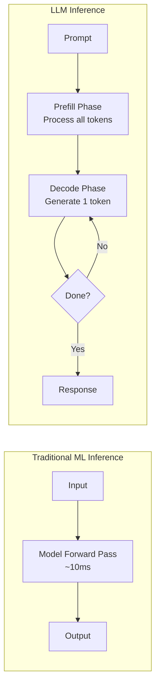

**Key Differences:**

| Aspect | Traditional ML | LLM Inference |
|--------|---------------|---------------|
| **Latency Pattern** | Fixed | Variable (depends on output length) |
| **Memory Usage** | Static | Grows with context length |
| **Compute Pattern** | Batch-friendly | Sequential token generation |
| **State** | Stateless | KV cache must persist during generation |
| **Batching** | Simple | Complex (different sequence lengths) |

### 1.2 The Two Phases of LLM Inference

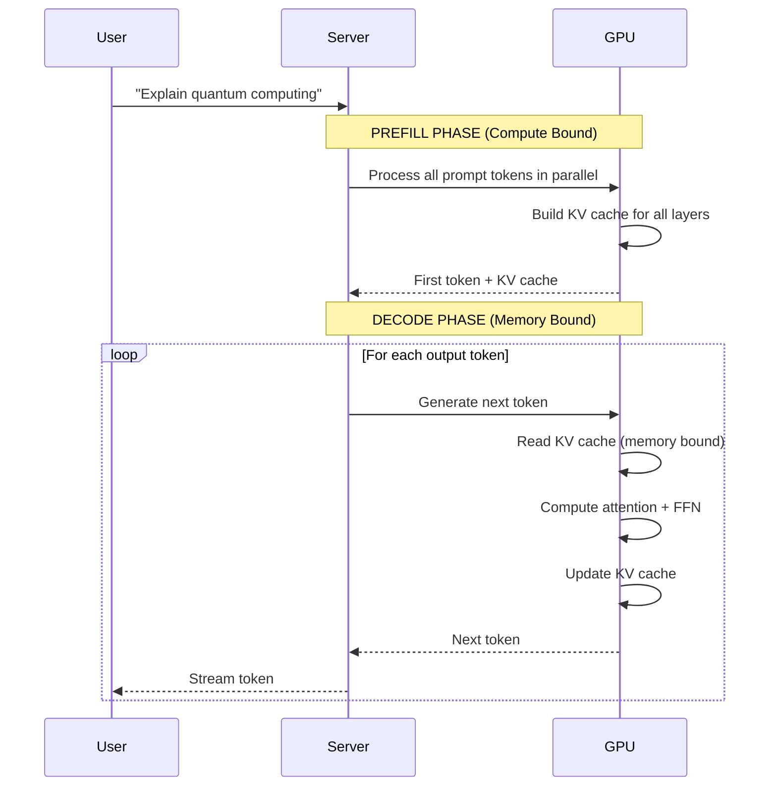

**Phase Characteristics:**

| Phase | Compute Pattern | Bottleneck | Optimization |
|-------|----------------|------------|--------------|
| **Prefill** | Parallel over tokens | Compute (FLOPs) | Tensor parallelism |
| **Decode** | Sequential, 1 token | Memory bandwidth | KV cache optimization |

---

## 2. The KV Cache Problem

### 2.1 What is the KV Cache?

During attention computation, the model computes Key (K) and Value (V) vectors for each token. These must be stored and reused for all subsequent token generations.

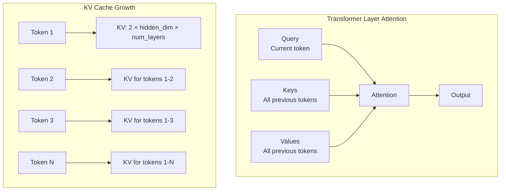

### 2.2 KV Cache Memory Requirements

For a typical LLM, KV cache memory per token:

```
KV_memory_per_token = 2 × num_layers × num_kv_heads × head_dim × dtype_size
```

**Example Calculations:**

| Model | Layers | KV Heads | Head Dim | KV/Token | 4K Context | 128K Context |
|-------|--------|----------|----------|----------|------------|--------------|
| Llama-2-7B | 32 | 32 | 128 | 512 KB | 2 GB | 64 GB |
| Llama-2-70B | 80 | 8 (GQA) | 128 | 320 KB | 1.3 GB | 40 GB |
| Llama-3-405B | 126 | 8 (GQA) | 128 | 504 KB | 2 GB | 64 GB |

### 2.3 The Memory Fragmentation Problem

Traditional KV cache allocation reserves contiguous memory for maximum sequence length:

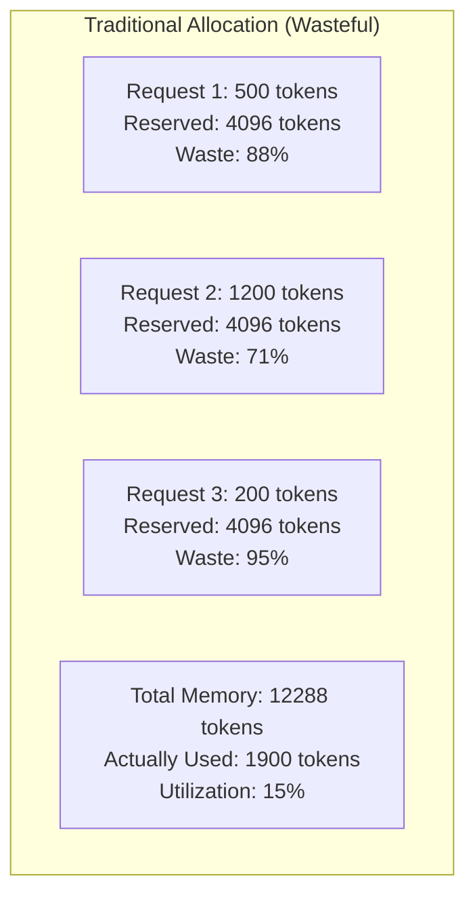

---

## 3. PagedAttention: The vLLM Innovation

### 3.1 How PagedAttention Works

PagedAttention (introduced by vLLM) applies operating system virtual memory concepts to KV cache management:

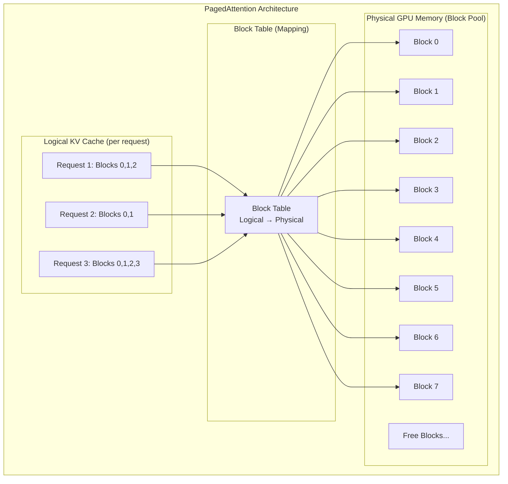

**Key Benefits:**

| Benefit | Description | Impact |
|---------|-------------|--------|
| **Near-zero waste** | Allocate only needed blocks | 4x more concurrent requests |
| **Dynamic allocation** | Add blocks as sequence grows | No pre-allocation needed |
| **Memory sharing** | Shared prompts share blocks | Efficient for chat with system prompts |
| **Efficient batching** | Non-contiguous memory is OK | Enables continuous batching |

### 3.2 PagedAttention in Practice

```python
from vllm import LLM, SamplingParams

# vLLM automatically uses PagedAttention
llm = LLM(
    model="meta-llama/Llama-3.1-8B-Instruct",
    gpu_memory_utilization=0.90,  # Use 90% of GPU memory for KV cache
    max_model_len=8192,           # Maximum sequence length
)

# PagedAttention enables high concurrency
sampling_params = SamplingParams(temperature=0.7, max_tokens=512)
outputs = llm.generate(prompts, sampling_params)
```

---

## 4. Continuous Batching

### 4.1 Static vs Continuous Batching

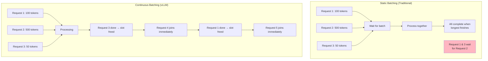

### 4.2 Continuous Batching Benefits

| Metric | Static Batching | Continuous Batching | Improvement |
|--------|-----------------|---------------------|-------------|
| **Throughput** | Limited by longest request | Near-optimal | 2-4x higher |
| **Latency (short)** | Blocked by long requests | Immediate | 5-10x lower |
| **GPU Utilization** | Low during batch gaps | Near 100% | 2-3x higher |
| **Memory Efficiency** | Reserved per-batch | Shared pool | Much better |

---

## 5. Multi-GPU Inference Strategies

### 5.1 Tensor Parallelism

Tensor parallelism splits individual layers across GPUs:

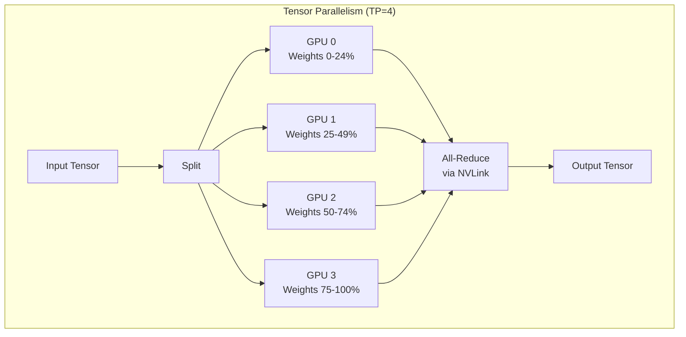

**Tensor Parallelism Characteristics:**

- **Best for**: Single-node with NVLink
- **Communication**: All-reduce after each layer (high bandwidth required)
- **Latency**: Minimal increase (NVLink is fast)
- **Scaling limit**: Typically 8 GPUs (single NVSwitch domain)

```python
from vllm import LLM

# Tensor parallelism across 4 GPUs
llm = LLM(
    model="meta-llama/Llama-3.1-70B-Instruct",
    tensor_parallel_size=4,  # Split layers across 4 GPUs
)
```

### 5.2 Pipeline Parallelism

Pipeline parallelism assigns different layers to different GPUs:

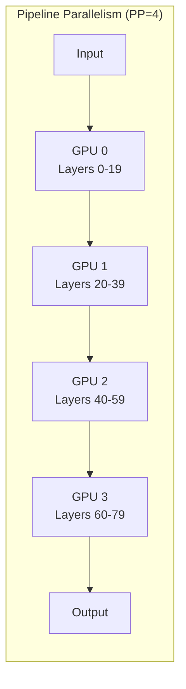

**Pipeline Parallelism Characteristics:**

- **Best for**: Multi-node or when NVLink bandwidth insufficient
- **Communication**: Point-to-point between adjacent GPUs
- **Latency**: Increases with pipeline depth (bubble overhead)
- **Scaling**: Can scale across nodes

```python
from vllm import LLM

# Combined tensor + pipeline parallelism
# 8 GPUs = 4-way tensor parallel × 2-way pipeline parallel
llm = LLM(
    model="meta-llama/Llama-3.1-405B-Instruct",
    tensor_parallel_size=4,
    pipeline_parallel_size=2,
)
```

### 5.3 Choosing a Parallelism Strategy

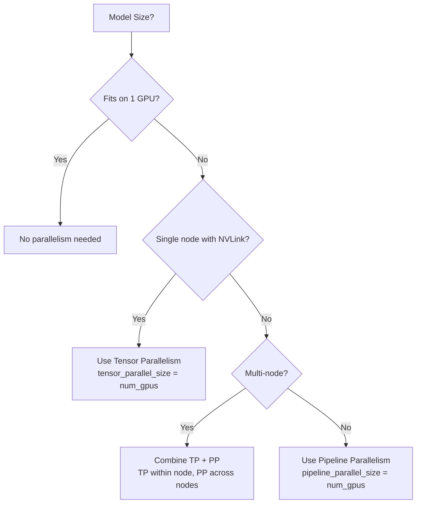

**Decision Guide:**

| Scenario | GPUs | Recommended | Configuration |
|----------|------|-------------|---------------|
| 7B model | 1 | None | Default |
| 70B model | 4 (NVLink) | TP=4 | `tensor_parallel_size=4` |
| 70B model | 8 (NVLink) | TP=8 | `tensor_parallel_size=8` |
| 405B model | 8 (NVLink) | TP=8 | `tensor_parallel_size=8` |
| 405B model | 16 (2 nodes) | TP=8, PP=2 | `tensor_parallel_size=8, pipeline_parallel_size=2` |

---

## 6. Inference Serving Solutions

### 6.1 Solution Comparison

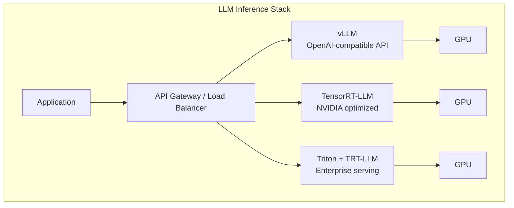

### 6.2 Detailed Comparison

| Feature | vLLM | TensorRT-LLM | Triton + TRT-LLM |
|---------|------|--------------|------------------|
| **Ease of Use** | Simple Python API | Requires model compilation | Complex setup |
| **Performance** | Excellent | Best (10-20% faster) | Best + multi-model |
| **Model Support** | Wide (HuggingFace) | NVIDIA-optimized models | Wide |
| **PagedAttention** | Yes | Yes (inflight batching) | Yes |
| **Continuous Batching** | Yes | Yes | Yes |
| **Quantization** | AWQ, GPTQ, FP8 | FP8, INT8, INT4 | All |
| **Multi-GPU** | TP + PP | TP + PP | TP + PP |
| **Production Features** | Basic | Basic | Full (metrics, A/B) |
| **License** | Apache 2.0 | Apache 2.0 | BSD |

### 6.3 vLLM Architecture

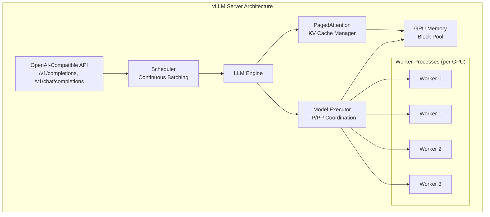

### 6.4 vLLM Deployment Example

```yaml
apiVersion: apps/v1
kind: Deployment
metadata:
  name: vllm-llama3
spec:
  replicas: 1
  selector:
    matchLabels:
      app: vllm-llama3
  template:
    metadata:
      labels:
        app: vllm-llama3
    spec:
      containers:
        - name: vllm
          image: vllm/vllm-openai:v0.11.2
          args:
            - --model
            - meta-llama/Llama-2-70b-chat-hf
            - --tensor-parallel-size
            - "4"
            - --gpu-memory-utilization
            - "0.90"
            - --max-model-len
            - "8192"
            - --enable-chunked-prefill
          ports:
            - containerPort: 8000
          resources:
            limits:
              nvidia.com/gpu: 4
          env:
            - name: HUGGING_FACE_HUB_TOKEN
              valueFrom:
                secretKeyRef:
                  name: hf-token
                  key: token
          readinessProbe:
            httpGet:
              path: /health
              port: 8000
            initialDelaySeconds: 60
            periodSeconds: 10
```

---

## 7. Performance Optimization

### 7.1 Key Optimization Techniques

| Technique | Description | Benefit |
|-----------|-------------|---------|
| **Chunked Prefill** | Process prefill in chunks, interleave with decode | Better latency for short requests |
| **Speculative Decoding** | Use small model to draft, large model to verify | 2-3x decode speedup |
| **Quantization** | Reduce precision (FP8, INT8, INT4) | 2-4x memory reduction |
| **KV Cache Quantization** | Quantize only KV cache | 2x more concurrent requests |
| **Prefix Caching** | Cache KV for common prefixes | Faster repeated prompts |

### 7.2 Quantization Trade-offs

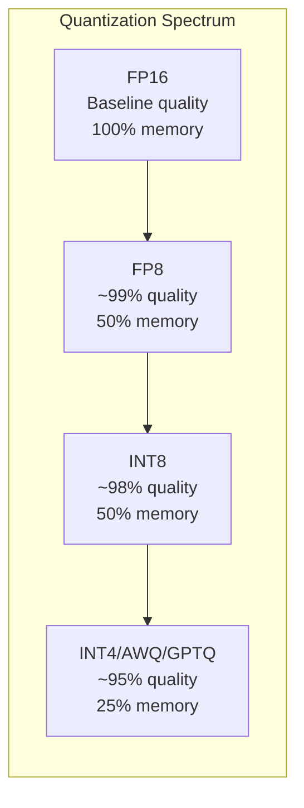

---

## 8. Inference Serving in k0rdent Enterprise

### 8.1 The k0rdent Inference Stack

In a k0rdent-managed environment, LLM inference services are deployed through the **Service Catalog** model rather than raw Kubernetes manifests. The k0rdent catalog provides production-ready ServiceTemplates for inference infrastructure:

| ServiceTemplate | Version | Role |
|----------------|---------|------|
| **kserve** | v0.15.0 | Kubernetes-native inference platform (supports vLLM, Triton, TensorFlow Serving) |
| **knative** | 1.19.0 | Serverless runtime (scale-to-zero, autoscaling) for KServe |
| **nvidia** (GPU Operator) | 25.10.0 | GPU enablement (drivers, runtime, device plugin) |
| **lws** (LeaderWorkerSet) | 0.7.0 | Multi-node distributed inference (model sharding across nodes) |
| **kuberay** | 1.3.2 | Ray Serve integration (alternative vLLM backend) |

### 8.2 KServe + vLLM: The Recommended Pattern

KServe is the k0rdent-native inference platform. vLLM runs as a **ServingRuntime** within KServe, gaining enterprise features automatically:

```yaml
apiVersion: serving.kserve.io/v1alpha1
kind: ServingRuntime
metadata:
  name: vllm-runtime
spec:
  supportedModelFormats:
    - name: vllm
      version: "1"
      autoSelect: true
  containers:
    - name: kserve-container
      image: vllm/vllm-openai:v0.11.2
      args:
        - --port=8080
      resources:
        limits:
          nvidia.com/gpu: 1
---
apiVersion: serving.kserve.io/v1beta1
kind: InferenceService
metadata:
  name: llama2-7b
spec:
  predictor:
    model:
      modelFormat:
        name: vllm
      runtime: vllm-runtime
      storageUri: "hf://meta-llama/Llama-2-7b-chat-hf"
      resources:
        limits:
          nvidia.com/gpu: 1
```

**What KServe adds over raw Deployment:**
- Autoscaling (including scale-to-zero for cost savings)
- Canary deployments and traffic splitting
- Standardized InferenceService API across model frameworks
- Built-in model storage management

### 8.3 Fleet Deployment via MultiClusterService

In k0rdent, inference infrastructure is deployed across managed clusters using MultiClusterService:

```yaml
apiVersion: k0rdent.mirantis.com/v1beta1
kind: MultiClusterService
metadata:
  name: inference-stack
  namespace: kcm-system
spec:
  clusterSelector:
    matchLabels:
      workload-type: inference
  serviceSpec:
    services:
      - template: kserve-0-15-0
        name: kserve
        namespace: kserve
      - template: gpu-operator-25-10-0
        name: gpu-operator
        namespace: gpu-operator
        values: |
          toolkit:
            env:
              - name: CONTAINERD_CONFIG
                value: /etc/k0s/containerd.d/nvidia.toml
              - name: CONTAINERD_SOCKET
                value: /run/k0s/containerd.sock
              - name: CONTAINERD_RUNTIME_CLASS
                value: nvidia
```

### 8.4 Distributed Inference with LeaderWorkerSet

For models that require pipeline parallelism across nodes, the **LeaderWorkerSet** (LWS) ServiceTemplate provides multi-host inference coordination. LWS manages pod groups as unified replication units — the leader process coordinates tensor/pipeline parallelism while workers execute model shards. This is particularly relevant for 405B+ models that exceed single-node GPU memory.

---

## 9. Key Takeaways

### LLM Inference Principles

1. **KV Cache is the Bottleneck**: Memory management determines throughput
2. **PagedAttention is Essential**: Enables 4x more concurrent requests
3. **Continuous Batching Maximizes GPU**: No idle time between requests
4. **Tensor Parallelism for Single-Node**: Use NVLink bandwidth
5. **Pipeline Parallelism for Multi-Node**: Lower bandwidth requirements

### Solution Selection Guide

| Use Case | Recommended Solution |
|----------|---------------------|
| Development/Prototyping | vLLM (simple setup) |
| Production (ease of use) | vLLM with OpenAI API |
| Production (max performance) | TensorRT-LLM |
| Multi-model serving | Triton Inference Server |
| Enterprise with support | NVIDIA NIM |
| k0rdent-managed fleet | KServe + vLLM via ServiceTemplate |

---

## References

### Inference Engines
- [vLLM Documentation](https://docs.vllm.ai/)
- [vLLM Paper: PagedAttention](https://arxiv.org/abs/2309.06180)
- [vLLM V1 Architecture Blog](https://blog.vllm.ai/2025/01/27/v1-alpha-release.html)
- [TensorRT-LLM Documentation](https://nvidia.github.io/TensorRT-LLM/)
- [Triton Inference Server](https://github.com/triton-inference-server/server)

### k0rdent Enterprise
- [k0rdent Documentation - Services](https://docs.k0rdent.io/latest/user/services/)
- [k0rdent Service Catalog](https://catalog.k0rdent.io/)
- [KServe in k0rdent Catalog](https://catalog.k0rdent.io/latest/apps/kserve/)
- [k0rdent Documentation - MultiClusterService](https://docs.k0rdent.io/latest/admin/ksm/ksm-multiclusterservice/)
- [vLLM KServe Integration](https://docs.vllm.ai/en/latest/deployment/integrations/kserve/)

### Research Papers
- [Efficient LLM Inference Survey](https://arxiv.org/abs/2312.15234)
- [AWQ: Activation-aware Weight Quantization](https://arxiv.org/abs/2306.00978)
- [FP8 Formats for Deep Learning](https://arxiv.org/abs/2209.05433)
