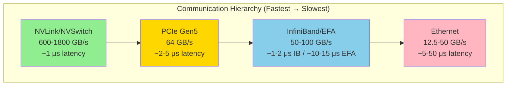
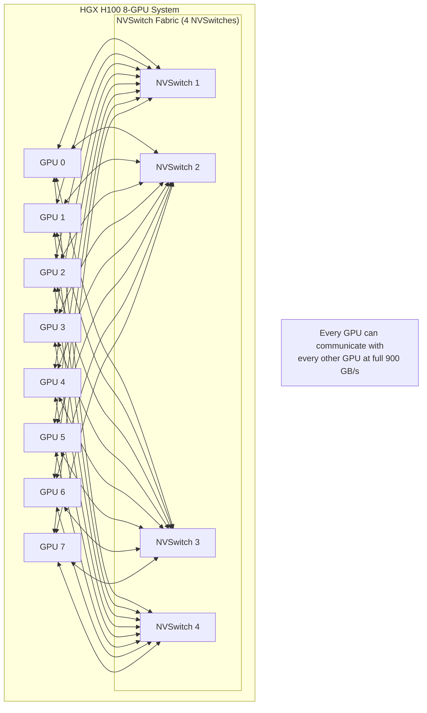
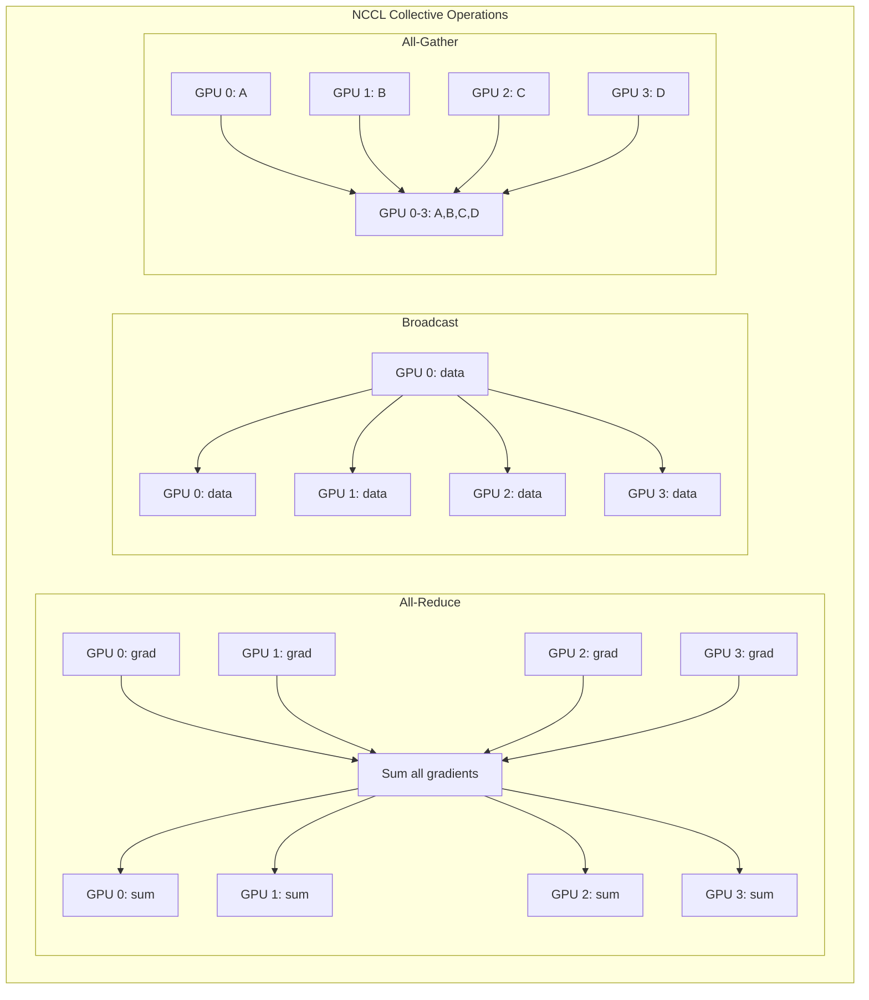
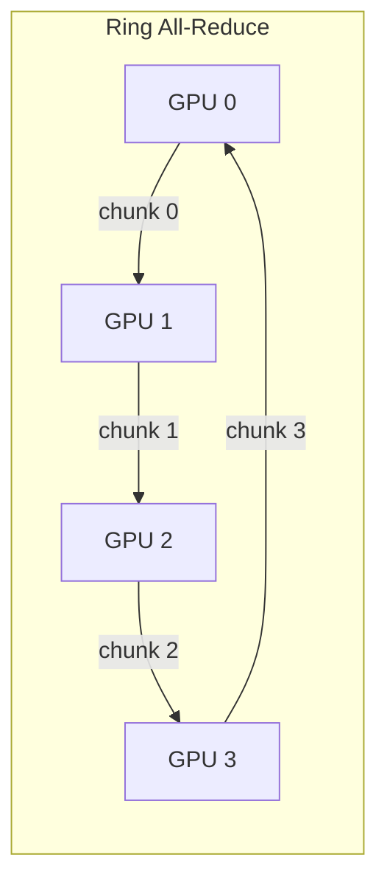
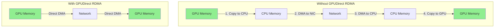
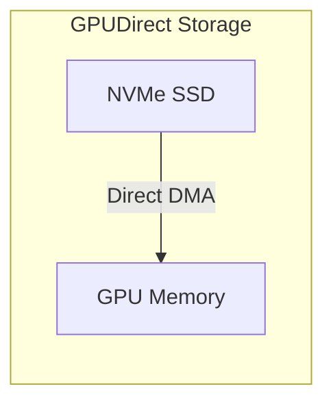
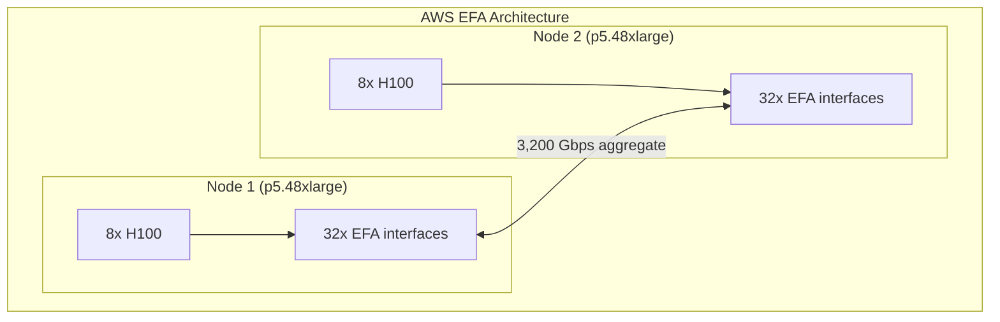
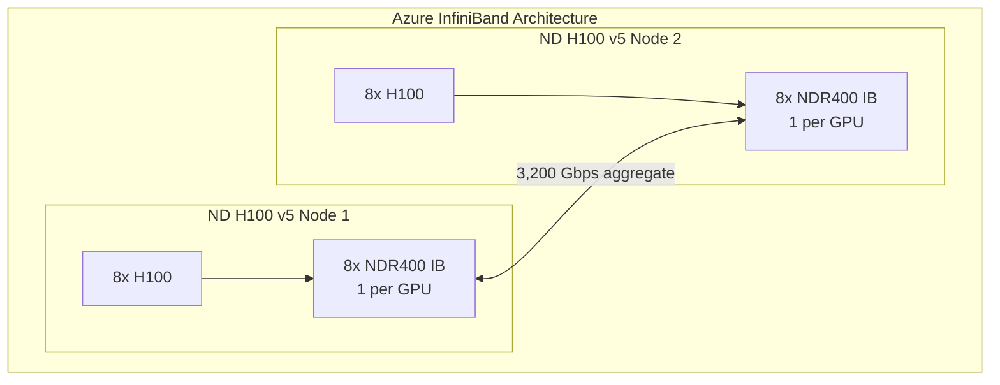
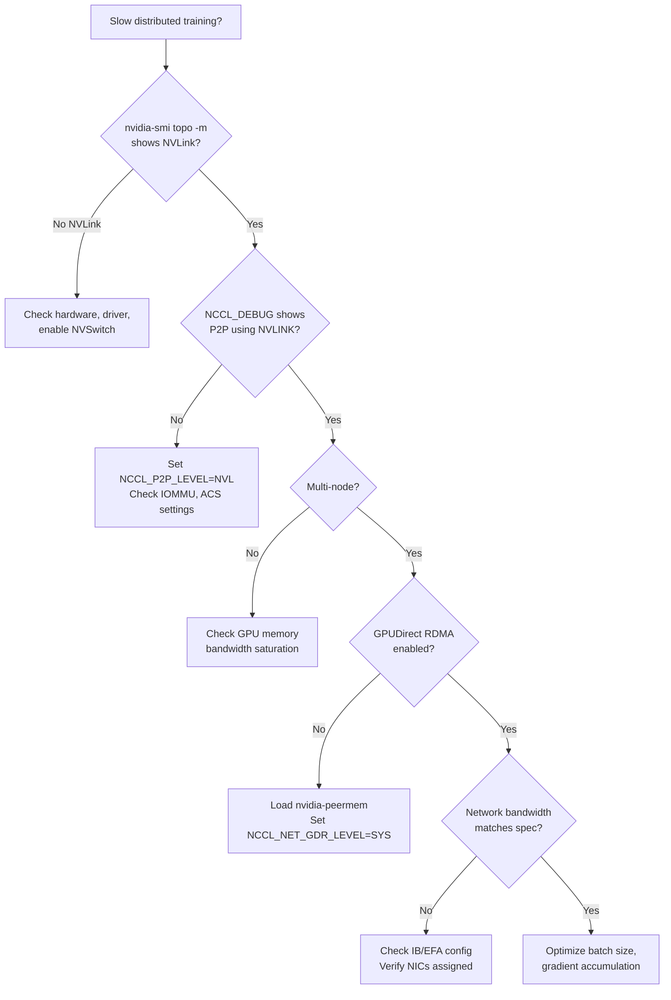

# 5.3 GPU Communication and Interconnect Architecture

**Duration:** 1 hour
**Type:** Theory / Reading

## Learning Objectives

By the end of this module, you will be able to:

- [ ] Explain the GPU interconnect hierarchy (NVLink, NVSwitch, PCIe, InfiniBand)
- [ ] Describe NCCL and its role in distributed GPU communication
- [ ] Understand GPUDirect RDMA and its performance benefits
- [ ] Compare AWS EFA and Azure InfiniBand for multi-node GPU clusters
- [ ] Diagnose GPU communication bottlenecks using topology tools

---

## 1. The GPU Communication Hierarchy

### 1.1 Why GPU Communication Matters

In distributed AI workloads, GPUs must exchange data constantly:

- **Gradient synchronization** during training (all-reduce)
- **Activation transfer** in pipeline parallelism
- **KV cache sharing** in tensor parallel inference
- **Data loading** from storage

The interconnect determines whether your multi-GPU job runs at full speed or crawls.



### 1.2 Communication Bandwidth Requirements

| Operation | Data Size | Frequency | Required Bandwidth |
|-----------|-----------|-----------|-------------------|
| All-reduce (70B model) | ~140 GB gradients | Every batch | 100+ GB/s |
| Pipeline activation | ~1-10 GB | Every micro-batch | 10-50 GB/s |
| Tensor parallel | ~100 MB-1 GB | Every layer | 50-200 GB/s |
| Data loading | ~1-10 GB | Every batch | 1-10 GB/s |

---

## 2. NVLink and NVSwitch

### 2.1 NVLink Evolution

NVLink is NVIDIA's high-bandwidth GPU-to-GPU interconnect:

| Generation | Products | Links/GPU | BW/Link | Total BW/GPU |
|------------|----------|-----------|---------|--------------|
| NVLink 1.0 | P100 | 4 | 40 GB/s | 160 GB/s |
| NVLink 2.0 | V100 | 6 | 50 GB/s | 300 GB/s |
| NVLink 3.0 | A100 | 12 | 50 GB/s | 600 GB/s |
| NVLink 4.0 | H100/H200 | 18 | 50 GB/s | 900 GB/s |
| NVLink 5.0 | B100/B200 | 18 | 100 GB/s | 1.8 TB/s |

### 2.2 NVSwitch Architecture

NVSwitch creates a fully-connected fabric within a node:



**Key Benefits:**
- **Full bisection bandwidth**: Any GPU pair communicates at full speed
- **Non-blocking**: Concurrent transfers don't interfere
- **Low latency**: Sub-microsecond GPU-to-GPU

### 2.3 Reading GPU Topology

Use `nvidia-smi topo -m` to understand your system:

```
        GPU0    GPU1    GPU2    GPU3    GPU4    GPU5    GPU6    GPU7    NIC0    CPU
GPU0     X      NV18    NV18    NV18    NV18    NV18    NV18    NV18    SYS     SYS
GPU1    NV18     X      NV18    NV18    NV18    NV18    NV18    NV18    SYS     SYS
GPU2    NV18    NV18     X      NV18    NV18    NV18    NV18    NV18    SYS     SYS
GPU3    NV18    NV18    NV18     X      NV18    NV18    NV18    NV18    SYS     SYS
GPU4    NV18    NV18    NV18    NV18     X      NV18    NV18    NV18    PXB     SYS
GPU5    NV18    NV18    NV18    NV18    NV18     X      NV18    NV18    PXB     SYS
GPU6    NV18    NV18    NV18    NV18    NV18    NV18     X      NV18    PXB     SYS
GPU7    NV18    NV18    NV18    NV18    NV18    NV18    NV18     X      PXB     SYS

Legend:
  NV#   = Number of NVLinks
  SYS   = System (QPI/UPI) connection
  PXB   = PCIe via switch
  PHB   = PCIe via host bridge
  PIX   = PCIe via single switch
```

---

## 3. NCCL: NVIDIA Collective Communications Library

### 3.1 What is NCCL?

NCCL (pronounced "nickel") is NVIDIA's library for multi-GPU and multi-node collective operations. It automatically detects topology and chooses optimal communication paths.



### 3.2 NCCL Communication Algorithms

NCCL selects algorithms based on message size and topology:

| Algorithm | Best For | How It Works |
|-----------|----------|--------------|
| **Ring** | Large messages (>256KB) | Data flows around a ring of GPUs |
| **Tree** | Medium messages | Hierarchical reduce/broadcast |
| **NVLS** | NVSwitch systems | Direct all-to-all via NVSwitch |
| **CollNet** | InfiniBand SHARP | In-network reduction |



### 3.3 Critical NCCL Environment Variables

```bash
# Communication backend selection
export NCCL_NET_GDR_LEVEL=SYS        # Enable GPUDirect RDMA across NUMA nodes (LOC/PIX/PXB/PHB/SYS)
export NCCL_P2P_LEVEL=NVL            # Force NVLink for P2P (NVL, PIX, PXB, PHB, SYS)

# Debugging and logging
export NCCL_DEBUG=INFO               # INFO, WARN, or TRACE for troubleshooting
export NCCL_DEBUG_SUBSYS=ALL         # INIT, NET, GRAPH, etc.

# Performance tuning
export NCCL_BUFFSIZE=8388608         # 8MB buffer (default 4MB)
export NCCL_NTHREADS=512             # CUDA threads for NCCL kernels

# InfiniBand settings (Azure)
export NCCL_IB_DISABLE=0             # Enable InfiniBand
export NCCL_IB_HCA=mlx5              # Use Mellanox HCA

# AWS EFA settings
export FI_EFA_USE_DEVICE_RDMA=1      # Enable EFA RDMA
export FI_PROVIDER=efa               # Use EFA provider
```

### 3.4 NCCL Performance Testing

```bash
# Build and run NCCL tests
git clone https://github.com/NVIDIA/nccl-tests.git
cd nccl-tests
make MPI=1 CUDA_HOME=/usr/local/cuda

# All-reduce benchmark
mpirun -np 8 --bind-to numa \
    ./build/all_reduce_perf \
    -b 1M -e 1G -f 2 -g 1

# Expected output (8x H100 NVLink, ring all-reduce):
#                                           out-of-place                       in-place
#       size(B)  count   type   redop  root   time(us)  algbw(GB/s)  busbw(GB/s)  #wrong   time(us)  algbw(GB/s)  busbw(GB/s)  #wrong
#      1048576      1  float    sum    -1      32.4       32.4         56.6         0       32.1       32.6         57.1         0
#     16777216     16  float    sum    -1     315.2       53.2         93.1         0      313.8       53.5         93.6         0
#    268435456    256  float    sum    -1    1089.8      246.3        431.1         0     1085.4      247.3        432.8         0
#   1073741824   1024  float    sum    -1    4000.7      268.4        469.7         0     3995.2      268.8        470.4         0
# Note: busbw = algbw × 2(n-1)/n = algbw × 1.75 for 8 GPUs
```

---

## 4. GPUDirect Technologies

### 4.1 GPUDirect RDMA

GPUDirect RDMA allows network adapters to directly access GPU memory, bypassing the CPU:



**Requirements:**
- NVIDIA GPU with RDMA support (Volta or newer)
- Mellanox/NVIDIA ConnectX NIC (InfiniBand or RoCE)
- nvidia-peermem kernel module loaded
- Same PCIe root complex for GPU and NIC

### 4.2 GPUDirect Storage

GPUDirect Storage enables direct transfers between NVMe storage and GPU memory:



**Benefits:**
- 10x faster data loading for training
- Reduced CPU overhead
- Essential for large dataset training

### 4.3 Verifying GPUDirect

```bash
# Check nvidia-peermem module
lsmod | grep nvidia_peermem

# Load if not present
modprobe nvidia-peermem

# Verify RDMA capability
ibv_devinfo | grep -A5 "hca_id"

# Test GPUDirect RDMA with perftest
ib_write_bw -d mlx5_0 -a --use_cuda=0  # Server
ib_write_bw -d mlx5_0 -a --use_cuda=0 <server_ip>  # Client
```

---

## 5. Multi-Node Networking

### 5.1 AWS Elastic Fabric Adapter (EFA)

EFA is AWS's high-performance networking for HPC and ML workloads:



**EFA Configuration:**

```yaml
# Kubernetes pod with EFA
apiVersion: v1
kind: Pod
spec:
  containers:
    - name: training
      resources:
        limits:
          nvidia.com/gpu: 8
          vpc.amazonaws.com/efa: 4  # Request 4 EFA interfaces
      env:
        - name: FI_EFA_USE_DEVICE_RDMA
          value: "1"
        - name: FI_PROVIDER
          value: "efa"
        - name: NCCL_DEBUG
          value: "INFO"
```

### 5.2 Azure InfiniBand

Azure ND-series VMs include InfiniBand for GPU clusters:

| VM Series | GPUs | InfiniBand | Bandwidth |
|-----------|------|------------|-----------|
| ND A100 v4 | 8x A100 | HDR | 8x 200 Gbps = 1,600 Gbps |
| ND H100 v5 | 8x H100 | NDR | 8x 400 Gbps = 3,200 Gbps |



**Azure InfiniBand Configuration:**

```yaml
# NCCL settings for Azure InfiniBand
env:
  - name: NCCL_IB_DISABLE
    value: "0"
  - name: NCCL_IB_HCA
    value: "mlx5"
  - name: NCCL_SOCKET_IFNAME
    value: "eth0"
  - name: NCCL_DEBUG
    value: "INFO"
  - name: UCX_TLS
    value: "rc,cuda_copy,cuda_ipc"
```

### 5.3 AWS vs Azure Comparison

| Feature | AWS EFA | Azure InfiniBand |
|---------|---------|------------------|
| **Protocol** | SRD (via libfabric) | Standard IB Verbs |
| **Max Bandwidth** | 3,200 Gbps (p5.48xlarge) | 3,200 Gbps (ND H100 v5) |
| **GPUDirect RDMA** | Yes (p4d, p5) | Yes |
| **NCCL Support** | Via aws-ofi-nccl plugin | Native |
| **VM Types** | p4d, p4de, p5 | ND A100, ND H100 |
| **Latency** | ~10-15 μs | ~1-2 μs |

---

## 6. Diagnosing Communication Issues

### 6.1 Common Problems and Solutions

| Symptom | Possible Cause | Diagnostic | Solution |
|---------|---------------|------------|----------|
| Slow all-reduce | PCIe fallback | `NCCL_DEBUG=INFO` shows "NET/Socket" | Check NVLink, set `NCCL_P2P_LEVEL=NVL` |
| Training hangs | NCCL timeout | Jobs stuck at barrier | Increase `NCCL_IB_TIMEOUT` (1-31, default 20), check network |
| Low bandwidth | No GPUDirect | `NCCL_DEBUG` shows CPU copies | Load nvidia-peermem, check PCIe ACS |
| Node failures | Network issues | IB errors in dmesg | Check IB fabric, reset HCA |

### 6.2 Diagnostic Commands

```bash
# Check NCCL version and build
python -c "import torch; print(torch.cuda.nccl.version())"

# Monitor GPU NVLink traffic
nvidia-smi nvlink -gt d  # Show data counters

# Monitor InfiniBand traffic
perfquery -x  # Extended port counters

# Check for PCIe ACS (blocks P2P)
lspci -vvv | grep ACSCtl

# Monitor NCCL in real-time
export NCCL_DEBUG=INFO
export NCCL_DEBUG_FILE=/tmp/nccl_debug_%h_%p.log
```

### 6.3 Performance Debugging Flowchart



---

## 7. Kubernetes GPU Communication Setup

### 7.1 NVIDIA Network Operator

For InfiniBand/RoCE support in Kubernetes:

```yaml
apiVersion: mellanox.com/v1alpha1
kind: NicClusterPolicy
metadata:
  name: nic-cluster-policy
spec:
  rdmaSharedDevicePlugin:
    image: k8s-rdma-shared-dev-plugin
    repository: nvcr.io/nvidia/mellanox
    version: network-operator-v25.7.0
    config: |
      {
        "configList": [{
          "resourceName": "rdma_shared_device_a",
          "rdmaHcaMax": 63,
          "selectors": { "vendors": ["15b3"] }
        }]
      }
  # Note: nvPeerDriver was removed in Network Operator v23.7.0.
  # nvidia-peermem is now built into GPU driver R470+ and managed by GPU Operator.
```

### 7.2 Pod Configuration for RDMA

```yaml
apiVersion: v1
kind: Pod
metadata:
  name: nccl-test
spec:
  containers:
    - name: nccl
      image: nvcr.io/nvidia/pytorch:24.01-py3
      resources:
        limits:
          nvidia.com/gpu: 8
          rdma/rdma_shared_device_a: 1
      securityContext:
        capabilities:
          add: ["IPC_LOCK"]  # Required for RDMA
      env:
        - name: NCCL_DEBUG
          value: "INFO"
        - name: NCCL_IB_DISABLE
          value: "0"
```

---

## 8. Key Takeaways

### Communication Hierarchy Rules

1. **NVLink First**: Always use NVLink within a node (10x faster than PCIe)
2. **GPUDirect RDMA**: Enable for multi-node to avoid CPU copies
3. **NCCL Auto-Tunes**: But verify with NCCL_DEBUG=INFO
4. **PCIe is a Fallback**: If you see PCIe in logs, something is wrong
5. **Network Matters**: EFA/InfiniBand essential for multi-node scaling

### Quick Reference

| Scenario | Expected Bandwidth | Key Settings |
|----------|-------------------|--------------|
| Single node, 8 GPU | ~470 GB/s busbw (H100) | NCCL_P2P_LEVEL=NVL |
| Multi-node, IB | 1,600-3,200 Gbps | NCCL_IB_HCA, NCCL_NET_GDR_LEVEL=SYS |
| Multi-node, EFA | 400-3,200 Gbps | FI_EFA_USE_DEVICE_RDMA=1 |

---

## 9. GPU Communication in k0rdent Enterprise

### 9.1 How k0rdent Delivers GPU Networking

In a k0rdent-managed environment, GPU communication infrastructure is deployed through **ServiceTemplates** from the [k0rdent catalog](https://catalog.k0rdent.io/). Two catalog entries are directly relevant to GPU interconnect:

| ServiceTemplate | Version | Role |
|----------------|---------|------|
| **gpu-operator** | 25.10.0 | GPU drivers, device plugin, DCGM, nvidia-peermem for GPUDirect RDMA |
| **nvidia-network-operator** | 25.10.0 | OFED drivers, RDMA shared device plugin, SR-IOV, NV-IPAM |

```
┌───────────────────────────────────────────────────┐
│              Management Cluster (k0s)              │
│                                                    │
│  ServiceTemplates (kcm-system namespace):          │
│  ├── gpu-operator-25-10-0                          │
│  └── nvidia-network-operator-25-10-0               │
│                                                    │
│  MultiClusterService ──► GPU Clusters              │
│    └── serviceSpec.services:                       │
│        ├── gpu-operator (drivers + peermem)         │
│        └── nvidia-network-operator (RDMA + OFED)   │
└───────────────────────────────────────────────────┘
```

### 9.2 Fleet Deployment via MultiClusterService

Deploy GPU communication infrastructure across all GPU clusters:

```yaml
apiVersion: k0rdent.mirantis.com/v1beta1
kind: MultiClusterService
metadata:
  name: gpu-networking-stack
  namespace: kcm-system
spec:
  clusterSelector:
    matchLabels:
      workload-type: gpu-training
  serviceSpec:
    services:
      - template: gpu-operator-25-10-0
        name: gpu-operator
        namespace: gpu-operator
        values: |
          toolkit:
            env:
              - name: CONTAINERD_CONFIG
                value: /etc/k0s/containerd.d/nvidia.toml
              - name: CONTAINERD_SOCKET
                value: /run/k0s/containerd.sock
              - name: CONTAINERD_RUNTIME_CLASS
                value: nvidia
          driver:
            rdma:
              enabled: true      # Enables nvidia-peermem for GPUDirect RDMA
              useHostMofed: true  # Use Network Operator's OFED drivers
      - template: nvidia-network-operator-25-10-0
        name: network-operator
        namespace: nvidia-network-operator
```

**Key points for k0rdent engineers:**

1. **GPU Operator manages nvidia-peermem**: Set `driver.rdma.enabled=true` to load the nvidia-peermem kernel module for GPUDirect RDMA. The legacy `nv_peer_mem` module and `nvPeerDriver` NicClusterPolicy field are deprecated.
2. **Network Operator manages RDMA device plugins**: The `NicClusterPolicy` CR (deployed by the Network Operator) configures `rdmaSharedDevicePlugin` to expose RDMA resources to pods via `rdma/rdma_shared_device_a`.
3. **k0s containerd paths**: GPU Operator toolkit must target `/etc/k0s/containerd.d/nvidia.toml` (config) and `/run/k0s/containerd.sock` (socket), consistent with Labs 5.1 and 5.2.
4. **NCCL environment variables** are set per-workload in pod specs (not in the operators), using string topology values like `NCCL_NET_GDR_LEVEL=SYS` and `NCCL_P2P_LEVEL=NVL`.

---

## References

- [NCCL Documentation](https://docs.nvidia.com/deeplearning/nccl/user-guide/docs/)
- [NCCL Environment Variables](https://docs.nvidia.com/deeplearning/nccl/user-guide/docs/env.html)
- [GPUDirect RDMA](https://docs.nvidia.com/cuda/gpudirect-rdma/)
- [AWS EFA Documentation](https://docs.aws.amazon.com/AWSEC2/latest/UserGuide/efa.html)
- [Azure InfiniBand](https://learn.microsoft.com/en-us/azure/virtual-machines/sizes/gpu-accelerated/nd-family)
- [NVIDIA Network Operator](https://docs.nvidia.com/networking/display/kubernetes2570/network+operator)
