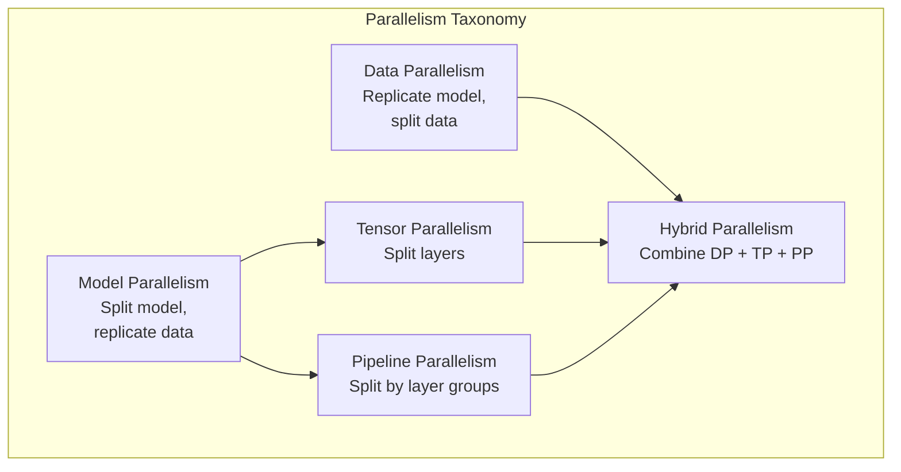
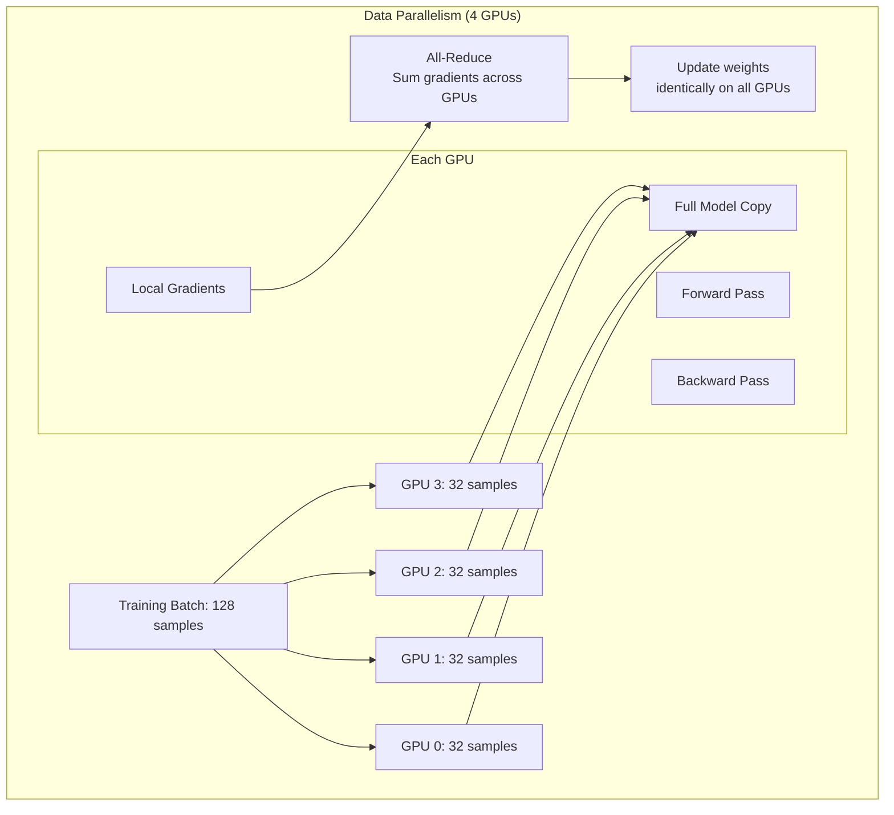
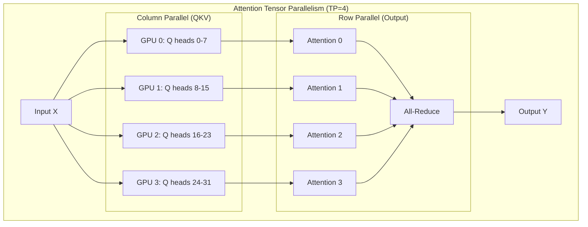
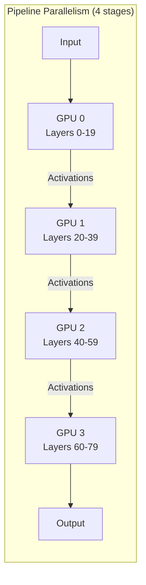
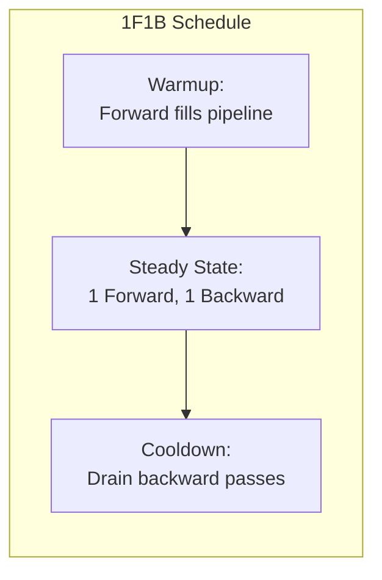
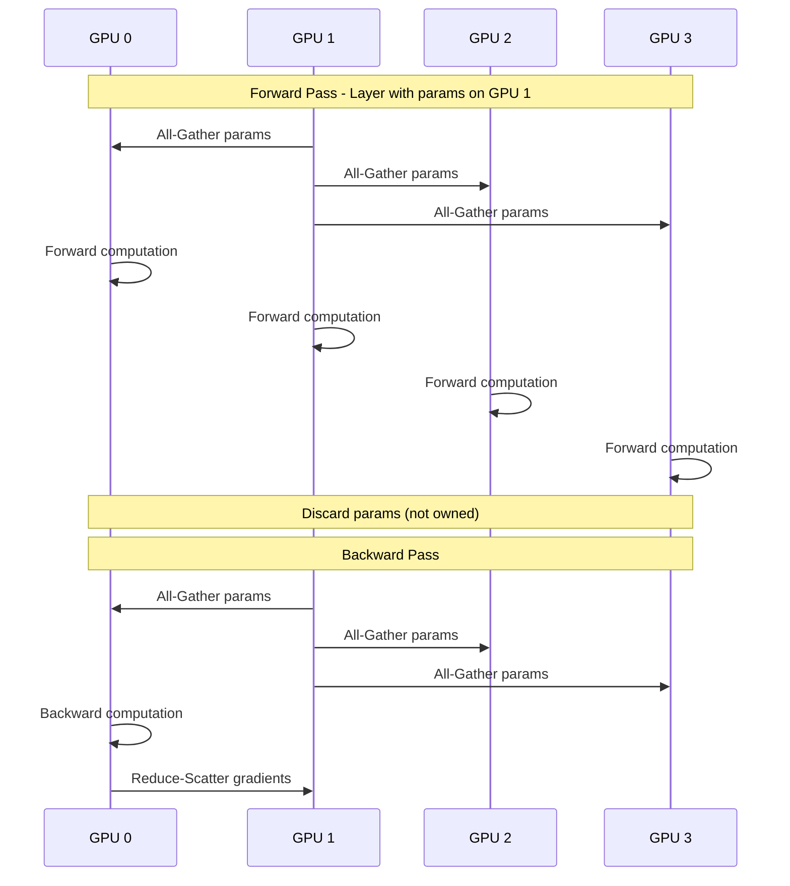
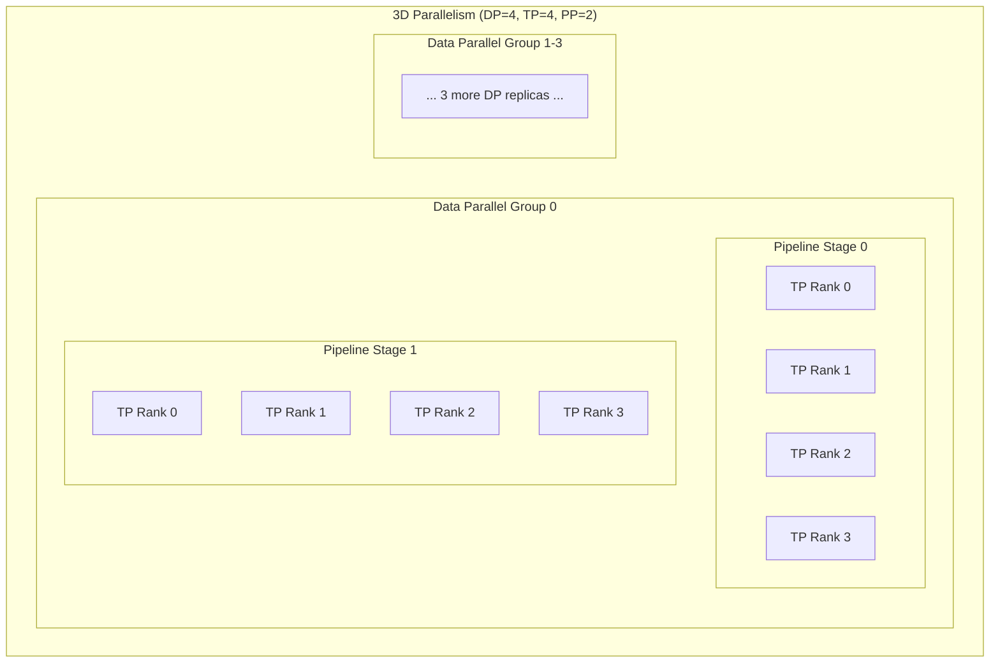
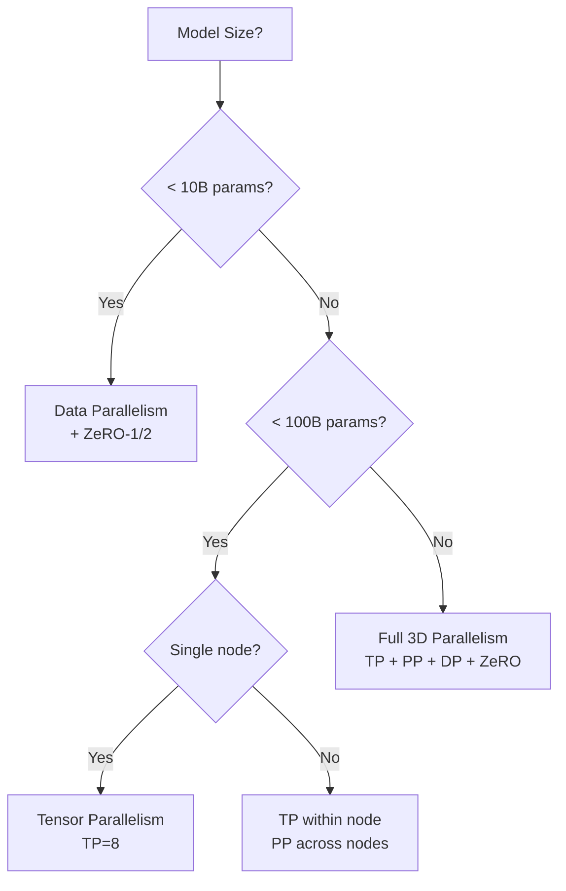

# 5.4 Distributed Training Patterns

**Duration:** 1 hour
**Type:** Theory / Reading

## Learning Objectives

By the end of this module, you will be able to:

- [ ] Explain why distributed training is necessary for large models
- [ ] Compare data parallelism, model parallelism, and pipeline parallelism
- [ ] Understand tensor parallelism and its communication requirements
- [ ] Describe ZeRO optimization and its memory efficiency benefits
- [ ] Design parallelism strategies for different model sizes

---

## 1. The Need for Distributed Training

### 1.1 Model Size Growth

Model sizes have grown exponentially, far outpacing single GPU memory:

| Year | Model | Parameters | Memory Required | GPUs Needed |
|------|-------|------------|-----------------|-------------|
| 2018 | BERT-Large | 340M | 1.4 GB | 1 |
| 2020 | GPT-3 | 175B | 700 GB | 8+ (A100 80GB) |
| 2023 | Llama 2 70B | 70B | 280 GB | 4+ (A100 80GB) |
| 2024 | Llama 3 405B | 405B | 1.6 TB | 16+ (H100 80GB) |
| 2024 | GPT-4 (est.) | 1.8T | 7.2 TB | 64+ (H100) |

### 1.2 Memory Breakdown During Training

Training requires significantly more memory than inference:

```mermaid
flowchart TB
    subgraph "Training Memory Requirements (FP32)"
        PARAMS[Model Parameters<br/>4 bytes/param]
        GRADS[Gradients<br/>4 bytes/param]
        OPTIM[Optimizer States<br/>8-12 bytes/param (Adam)]
        ACTS[Activations<br/>Variable (batch × sequence)]

        TOTAL[Total: 16-20 bytes/param<br/>+ activations]
    end

    PARAMS --> TOTAL
    GRADS --> TOTAL
    OPTIM --> TOTAL
    ACTS --> TOTAL
```

**Memory Example (70B model with Adam):**

| Component | Size |
|-----------|------|
| Parameters (FP16) | 140 GB |
| Gradients (FP16) | 140 GB |
| Adam momentum (FP32) | 280 GB |
| Adam variance (FP32) | 280 GB |
| Master weights (FP32) | 280 GB |
| **Subtotal (no activations)** | **1,120 GB** |
| Activations | Variable |

---

## 2. Parallelism Strategies Overview



---

## 3. Data Parallelism

### 3.1 How Data Parallelism Works

Data parallelism replicates the model on each GPU and splits the data:



### 3.2 PyTorch Distributed Data Parallel (DDP)

```python
import torch
import torch.distributed as dist
from torch.nn.parallel import DistributedDataParallel as DDP

def setup(rank, world_size):
    dist.init_process_group(
        backend="nccl",  # Use NCCL for GPU
        rank=rank,
        world_size=world_size
    )

def train(rank, world_size):
    setup(rank, world_size)

    # Create model and wrap with DDP
    model = MyModel().to(rank)
    model = DDP(model, device_ids=[rank])

    # Use DistributedSampler for data
    sampler = torch.utils.data.DistributedSampler(
        dataset, num_replicas=world_size, rank=rank
    )
    dataloader = DataLoader(dataset, sampler=sampler, batch_size=32)

    for epoch in range(num_epochs):
        sampler.set_epoch(epoch)  # Shuffle differently each epoch
        for batch in dataloader:
            loss = model(batch)
            loss.backward()  # DDP handles gradient sync
            optimizer.step()
```

### 3.3 Data Parallelism Scaling

| Aspect | Behavior | Limitation |
|--------|----------|------------|
| **Throughput** | Linear with GPUs | Network bandwidth for all-reduce |
| **Memory** | Each GPU needs full model | Cannot train if model > GPU memory |
| **Communication** | All-reduce every step | O(model_size) per step |
| **Batch Size** | Scales with GPUs | Learning rate adjustment needed |

**Scaling Limit:** Data parallelism alone works until model doesn't fit in single GPU memory (~70B parameters on 80GB GPU).

---

## 4. Tensor Parallelism

### 4.1 How Tensor Parallelism Works

Tensor parallelism splits individual layers across GPUs:

```mermaid
flowchart TB
    subgraph "Tensor Parallelism - Linear Layer"
        INPUT[Input: (batch, seq, hidden)]

        subgraph "Split Weight Matrix"
            W0[GPU 0: W[:, 0:H/4]]
            W1[GPU 1: W[:, H/4:H/2]]
            W2[GPU 2: W[:, H/2:3H/4]]
            W3[GPU 3: W[:, 3H/4:H]]
        end

        INPUT --> W0
        INPUT --> W1
        INPUT --> W2
        INPUT --> W3

        W0 --> AG[All-Gather]
        W1 --> AG
        W2 --> AG
        W3 --> AG

        AG --> OUTPUT[Output: (batch, seq, hidden)]
    end
```

### 4.2 Transformer Tensor Parallelism

Megatron-LM style tensor parallelism for attention:



### 4.3 Tensor Parallelism Communication

| Operation | Communication | Volume |
|-----------|---------------|--------|
| After QKV projection | None (independent) | 0 |
| After attention output | All-Reduce | batch × seq × hidden |
| After FFN first layer | None (column parallel) | 0 |
| After FFN second layer | All-Reduce | batch × seq × hidden |

**Per layer:** 2 all-reduce operations
**Requirement:** High-bandwidth interconnect (NVLink)

### 4.4 When to Use Tensor Parallelism

| Scenario | Recommendation |
|----------|----------------|
| Model fits on 1 GPU | Don't use TP |
| Model needs 2-8 GPUs, same node | TP only |
| Model needs multiple nodes | TP within node + PP across nodes |
| Training (need more memory) | Combine with ZeRO-3 |

---

## 5. Pipeline Parallelism

### 5.1 How Pipeline Parallelism Works

Pipeline parallelism assigns layer groups to different GPUs:



### 5.2 The Pipeline Bubble Problem

Naive pipeline parallelism has significant idle time (bubble):

```mermaid
gantt
    title Naive Pipeline (4 stages, 1 micro-batch)
    dateFormat X
    axisFormat %s

    section GPU 0
    Forward :f0, 0, 1
    Idle    :i0, 1, 4
    Backward:b0, 4, 5

    section GPU 1
    Idle    :i1a, 0, 1
    Forward :f1, 1, 2
    Idle    :i1b, 2, 4
    Backward:b1, 4, 5

    section GPU 2
    Idle    :i2a, 0, 2
    Forward :f2, 2, 3
    Idle    :i2b, 3, 4
    Backward:b2, 4, 5

    section GPU 3
    Idle    :i3a, 0, 3
    Forward :f3, 3, 4
    Backward:b3, 4, 5
```



**Bubble fraction:** `(pipeline_stages - 1) / total_micro_batches`

### 5.3 GPipe: Micro-batch Pipeline

GPipe reduces bubble by using multiple micro-batches:

```mermaid
gantt
    title GPipe (4 stages, 8 micro-batches)
    dateFormat X
    axisFormat %s

    section GPU 0
    F0 :f00, 0, 1
    F1 :f01, 1, 2
    F2 :f02, 2, 3
    F3 :f03, 3, 4
    F4 :f04, 4, 5
    F5 :f05, 5, 6
    F6 :f06, 6, 7
    F7 :f07, 7, 8
    B7 :b07, 11, 12
    B6 :b06, 12, 13
    B5 :b05, 13, 14
    B4 :b04, 14, 15
    B3 :b03, 15, 16
    B2 :b02, 16, 17
    B1 :b01, 17, 18
    B0 :b00, 18, 19

    section GPU 3
    F0 :f30, 3, 4
    F1 :f31, 4, 5
    F2 :f32, 5, 6
    F3 :f33, 6, 7
    F4 :f34, 7, 8
    F5 :f35, 8, 9
    F6 :f36, 9, 10
    F7 :f37, 10, 11
    B7 :b37, 11, 12
    B6 :b36, 12, 13
    B5 :b35, 13, 14
    B4 :b34, 14, 15
    B3 :b33, 15, 16
    B2 :b32, 16, 17
    B1 :b31, 17, 18
    B0 :b30, 18, 19
```



### 5.4 1F1B Pipeline Schedule

Interleaved 1-Forward-1-Backward minimizes memory:



**Benefits:**
- Constant memory (only 1 activation per stage)
- Better GPU utilization
- Standard in DeepSpeed and Megatron-LM

---

## 6. ZeRO: Zero Redundancy Optimizer

### 6.1 The Redundancy Problem

In data parallelism, every GPU stores:
- Full model parameters
- Full gradients
- Full optimizer states

This is highly redundant!

### 6.2 ZeRO Stages

```mermaid
flowchart TB
    subgraph "ZeRO Optimization Stages"
        subgraph "Baseline (Data Parallel)"
            BP[Each GPU:<br/>Params + Grads + Optimizer]
        end

        subgraph "ZeRO Stage 1"
            Z1[Partition Optimizer States<br/>Memory: ~4x reduction]
        end

        subgraph "ZeRO Stage 2"
            Z2[+ Partition Gradients<br/>Memory: ~8x reduction]
        end

        subgraph "ZeRO Stage 3"
            Z3[+ Partition Parameters<br/>Memory: ~Nx reduction<br/>(N = num GPUs)]
        end

        BP --> Z1 --> Z2 --> Z3
    end
```

### 6.3 ZeRO Memory Savings

For a 70B parameter model with 8 GPUs:

| Stage | Params | Grads | Optimizer | Total/GPU |
|-------|--------|-------|-----------|-----------|
| Baseline | 140 GB | 140 GB | 840 GB | 1,120 GB |
| ZeRO-1 | 140 GB | 140 GB | 105 GB | 385 GB |
| ZeRO-2 | 140 GB | 17.5 GB | 105 GB | 262.5 GB |
| ZeRO-3 | 17.5 GB | 17.5 GB | 105 GB | 140 GB |

### 6.4 ZeRO-3 Communication Pattern



### 6.5 DeepSpeed ZeRO Configuration

```python
# DeepSpeed config for ZeRO-3
ds_config = {
    "zero_optimization": {
        "stage": 3,
        "offload_optimizer": {
            "device": "cpu",  # Offload optimizer to CPU if needed
            "pin_memory": True
        },
        "offload_param": {
            "device": "cpu",  # Offload params to CPU if needed
            "pin_memory": True
        },
        "overlap_comm": True,
        "contiguous_gradients": True,
        "sub_group_size": 1e9,
        "reduce_bucket_size": 1e9,
        "stage3_prefetch_bucket_size": 5e8,
        "stage3_param_persistence_threshold": 1e6,
        "stage3_max_live_parameters": 1e9,
        "stage3_max_reuse_distance": 1e9,
    },
    "bf16": {"enabled": True},
    "train_batch_size": 256,
    "train_micro_batch_size_per_gpu": 4,
}
```

---

## 7. Combining Parallelism Strategies

### 7.1 3D Parallelism

Modern large model training combines all strategies:



**Total GPUs:** `DP × TP × PP = 4 × 4 × 2 = 32 GPUs`

### 7.2 Choosing Parallelism Strategy



### 7.3 Example Configurations

| Model | GPUs | Configuration |
|-------|------|---------------|
| 7B | 8 | DP=8, ZeRO-2 |
| 70B | 8 | TP=8 (single node) |
| 70B | 32 | TP=8, DP=4 |
| 405B | 128 | TP=8, PP=2, DP=8 |
| 1T+ | 512+ | TP=8, PP=8, DP=8, ZeRO-3 |

---

## 8. Kubernetes Distributed Training

### 8.1 Kubeflow Training Operator

```yaml
apiVersion: kubeflow.org/v1
kind: PyTorchJob
metadata:
  name: llama-distributed-training
spec:
  pytorchReplicaSpecs:
    Master:
      replicas: 1
      restartPolicy: OnFailure
      template:
        spec:
          containers:
            - name: pytorch
              image: pytorch/pytorch:2.1.0-cuda12.1-cudnn8-runtime
              command:
                - torchrun
                - --nnodes=4
                - --nproc_per_node=8
                - --rdzv_backend=c10d
                - --rdzv_endpoint=$(MASTER_ADDR):29500
                - train.py
              resources:
                limits:
                  nvidia.com/gpu: 8
              env:
                - name: NCCL_DEBUG
                  value: "INFO"
    Worker:
      replicas: 3
      restartPolicy: OnFailure
      template:
        spec:
          containers:
            - name: pytorch
              image: pytorch/pytorch:2.1.0-cuda12.1-cudnn8-runtime
              command:
                - torchrun
                - --nnodes=4
                - --nproc_per_node=8
                - --rdzv_backend=c10d
                - --rdzv_endpoint=$(MASTER_ADDR):29500
                - train.py
              resources:
                limits:
                  nvidia.com/gpu: 8
```

### 8.2 Gang Scheduling for Training

```yaml
apiVersion: batch/v1
kind: Job
metadata:
  name: distributed-training
  annotations:
    # Volcano gang scheduling
    scheduling.volcano.sh/group-name: "training-gang"
    scheduling.volcano.sh/min-available: "4"
spec:
  parallelism: 4
  completions: 4
  template:
    spec:
      schedulerName: volcano
      containers:
        - name: worker
          resources:
            limits:
              nvidia.com/gpu: 8
```

---

## 9. Key Takeaways

### Parallelism Decision Framework

1. **Data Parallelism**: Default choice, scale throughput
2. **Tensor Parallelism**: When model > GPU memory, need NVLink
3. **Pipeline Parallelism**: Multi-node, lower bandwidth OK
4. **ZeRO**: Memory efficiency without model changes
5. **3D Parallelism**: Largest models, combine all strategies

### Communication Requirements

| Strategy | Communication | Bandwidth Need |
|----------|---------------|----------------|
| Data Parallel | All-reduce (gradients) | Medium |
| Tensor Parallel | All-reduce (activations) | High (NVLink) |
| Pipeline Parallel | Point-to-point | Low-Medium |
| ZeRO-3 | All-gather + reduce-scatter | High |

---

## References

- [Megatron-LM Paper](https://arxiv.org/abs/1909.08053)
- [GPipe Paper](https://arxiv.org/abs/1811.06965)
- [ZeRO Paper](https://arxiv.org/abs/1910.02054)
- [DeepSpeed Documentation](https://www.deepspeed.ai/)
- [PyTorch Distributed](https://pytorch.org/tutorials/intermediate/ddp_tutorial.html)
- [Kubeflow Training Operator](https://www.kubeflow.org/docs/components/training/)
